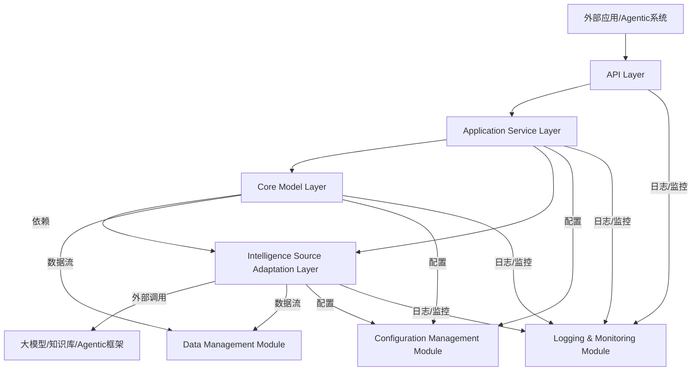
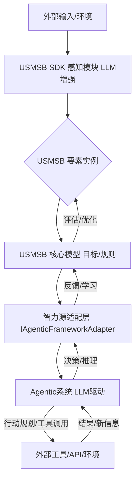
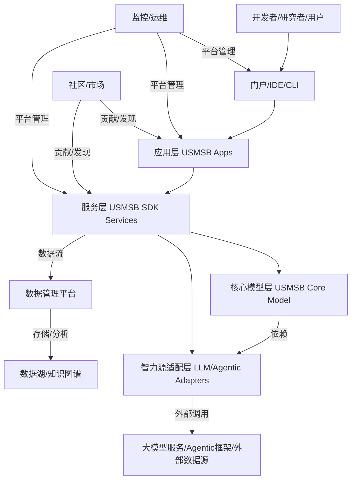

# USMSB模型SDK总体架构设计

## 1. 引言

本设计文档旨在阐述USMSB（社会行为的通用系统模型）SDK的总体架构。该SDK的目标是提供一套标准化的接口和工具集，使开发者能够方便地在各类应用中集成和利用USMSB模型，尤其是在大模型驱动的Agentic系统开发中，将大模型作为USMSB模型中的“智力源泉”进行深度融合。本设计将从模块划分、核心组件、数据流、接口设计等方面进行详细说明，为后续的开发工作奠定基础。

## 2. 设计原则

USMSB SDK的设计将遵循以下核心原则：

*   **模块化与可扩展性**：SDK应划分为清晰的模块，各模块职责明确，便于独立开发、测试和维护。同时，架构应具备良好的可扩展性，能够方便地引入新的USMSB要素、行动、逻辑或外部智力源（如不同的大模型）。
*   **灵活性与可配置性**：SDK应提供灵活的配置选项，允许开发者根据具体应用场景调整模型参数、选择不同的智力源和集成策略。
*   **高性能与效率**：考虑到大模型推理可能带来的性能开销，SDK应优化数据处理流程，支持异步操作，并提供缓存机制以提高效率。
*   **易用性与开发者友好**：提供简洁、直观的API接口和详尽的文档，降低开发者的学习成本和使用门槛。
*   **可观测性与调试性**：提供日志记录、事件追踪等机制，便于开发者监控SDK的运行状态、诊断问题和优化性能。
*   **安全性与隐私保护**：在处理敏感数据和调用外部服务时，SDK应遵循安全最佳实践，确保数据传输和存储的安全性，并提供必要的隐私保护机制。

## 3. 总体架构概览

USMSB SDK的总体架构将采用分层设计，主要包括以下几个核心层：

1.  **核心模型层 (Core Model Layer)**：实现USMSB模型的核心要素、通用行动和核心逻辑的抽象与定义。这是SDK的基础，不依赖于具体的智力源。
2.  **智力源适配层 (Intelligence Source Adaptation Layer)**：负责与外部大模型、知识库、Agentic框架等智力源进行交互，将外部智力源的能力适配到USMSB模型中。
3.  **应用服务层 (Application Service Layer)**：基于核心模型层和智力源适配层，提供面向具体应用场景的高级服务和功能，如行为预测、决策支持、系统模拟等。
4.  **接口层 (API Layer)**：提供统一的编程接口，供外部应用调用SDK的功能。

此外，还将包括**数据管理模块**、**配置管理模块**、**日志与监控模块**等支撑组件。

## 4. 核心模块详细设计

### 4.1 核心模型层 (Core Model Layer)

该层是USMSB SDK的基础，负责定义和管理USMSB模型中的核心概念。它将是相对稳定的部分，不直接依赖于具体的大模型实现。

#### 4.1.1 USMSB要素定义

将USMSB模型中的九个核心要素（主体、客体、目标、资源、规则、信息、价值、风险、环境）定义为数据结构或类。每个要素应包含其基本属性和相关操作。

*   **Agent (主体)**：
    *   属性：ID, 名称, 类型 (人类、AI Agent、组织、自然实体等), 能力集, 状态, 目标列表, 资源持有量, 规则集引用。
    *   操作：`perceive()`, `decide()`, `execute()`, `interact()`, `learn()`, `manage_risk()`。
*   **Object (客体)**：
    *   属性：ID, 名称, 类型, 状态, 属性集合。
    *   操作：`transform()`, `get_state()`, `set_state()`。
*   **Goal (目标)**：
    *   属性：ID, 名称, 描述, 优先级, 状态 (未开始、进行中、已完成、失败), 关联主体。
    *   操作：`is_achieved()`, `update_status()`。
*   **Resource (资源)**：
    *   属性：ID, 名称, 类型 (有形、无形), 数量/价值, 状态 (可用、消耗、转化中), 持有者。
    *   操作：`allocate()`, `consume()`, `transform()`。
*   **Rule (规则)**：
    *   属性：ID, 名称, 描述, 类型 (法律、政策、规范、算法逻辑), 适用范围, 优先级。
    *   操作：`check_compliance()`, `apply_rule()`。
*   **Information (信息)**：
    *   属性：ID, 内容, 类型 (文本、图像、数据), 来源, 时间戳, 质量/可信度。
    *   操作：`process()`, `filter()`, `retrieve()`。
*   **Value (价值)**：
    *   属性：ID, 名称, 类型 (经济、社会、健康、情感), 量化指标/描述, 关联主体/客体。
    *   操作：`calculate()`, `assess()`。
*   **Risk (风险)**：
    *   属性：ID, 名称, 描述, 类型, 发生概率, 潜在影响, 关联主体/客体/行动。
    *   操作：`assess()`, `mitigate()`, `identify()`。
*   **Environment (环境)**：
    *   属性：ID, 名称, 类型 (自然、社会、技术), 状态, 影响因素。
    *   操作：`get_state()`, `update_state()`, `simulate_change()`。

#### 4.1.2 USMSB通用行动接口

定义一系列抽象接口，代表USMSB模型中的通用行动。这些接口将由智力源适配层或应用服务层具体实现。

*   `IPerceptionService`：提供感知能力，如文本理解、图像识别、数据分析等。
*   `IDecisionService`：提供决策能力，如行动选择、策略生成、路径规划等。
*   `IExecutionService`：提供执行能力，如代码执行、API调用、模拟操作等。
*   `IInteractionService`：提供交互能力，如多Agent通信、人机对话等。
*   `ITransformationService`：提供转化能力，如数据格式转换、资源形态转换等。
*   `IEvaluationService`：提供评估能力，如效果评估、风险评估、价值评估等。
*   `IFeedbackService`：提供反馈处理能力，如用户反馈分析、系统自适应调整等。
*   `ILearningService`：提供学习能力，如模型微调、知识更新、行为优化等。
*   `IRiskManagementService`：提供风险管理能力，如风险识别、风险规避、风险缓解等。

#### 4.1.3 USMSB核心逻辑实现

实现USMSB模型中的六个核心逻辑，这些逻辑将协调各个要素和通用行动，形成完整的系统行为。

*   **Goal-Action-Outcome Loop (目标-行动-结果循环)**：实现一个通用的循环引擎，根据目标驱动Agent的感知、决策、执行，并根据结果进行评估和反馈。
*   **Resource-Transformation-Value Chain (资源-转化-价值增值链)**：提供工具函数，用于追踪资源在系统中的流动、转化和价值增值过程。
*   **Information-Decision-Control Loop (信息-决策-控制回路)**：构建信息处理管道，将感知到的信息输入决策模块，决策结果控制执行，执行结果产生新的信息。
*   **System-Environment Interaction (系统-环境互动)**：提供接口和机制，模拟或管理系统与外部环境的交互，包括环境状态的获取和系统对环境的影响。
*   **Emergence and Self-organization (涌现与自组织)**：提供分析工具，用于识别和分析系统中涌现的宏观模式和自组织行为。
*   **Adaptation and Evolution (适应与演化)**：实现机制，支持系统根据反馈和学习进行自我调整和演化。

### 4.2 智力源适配层 (Intelligence Source Adaptation Layer)

该层是SDK的关键创新点，负责将外部大模型、知识库、Agentic框架等作为USMSB模型中的“智力源”进行集成。它将定义统一的适配接口，允许接入不同类型和厂商的智力源。

#### 4.2.1 智力源抽象接口

定义一套抽象接口，用于封装不同智力源的具体实现细节，向上层提供统一的调用方式。

*   `IIntelligenceSource`：通用智力源接口，包含初始化、调用、关闭等方法。
*   `ILLMAdapter`：大模型适配器接口，封装大模型的文本生成、理解、推理等能力。
    *   方法：`generate_text(prompt, context)`, `understand_intent(text)`, `reason(facts, query)`。
*   `IKnowledgeBaseAdapter`：知识库适配器接口，封装知识检索、知识图谱查询等能力。
    *   方法：`query_knowledge(query)`, `retrieve_facts(entity)`。
*   `IAgenticFrameworkAdapter`：Agentic框架适配器接口，封装Agent的规划、工具使用、多Agent协作等能力。
    *   方法：`plan_action(goal, context)`, `use_tool(tool_name, params)`, `coordinate_agents(task, agents)`。

#### 4.2.2 具体智力源实现

针对不同的大模型（如Gemini, GPT系列, Llama等）、知识库（如向量数据库、图数据库）、Agentic框架（如LangChain, AutoGen）提供具体的适配器实现。这些实现将负责将USMSB模型中的请求转换为智力源可理解的格式，并解析智力源的响应。

*   `GeminiLLMAdapter`：实现`ILLMAdapter`接口，调用Gemini API。
*   `GPTLLMAdapter`：实现`ILLMAdapter`接口，调用OpenAI GPT API。
*   `VectorDBKnowledgeBaseAdapter`：实现`IKnowledgeBaseAdapter`接口，与向量数据库交互。
*   `LangChainAgenticAdapter`：实现`IAgenticFrameworkAdapter`接口，封装LangChain的工作流。

#### 4.2.3 智力源管理

提供机制来管理和配置可用的智力源，包括注册、激活、负载均衡、故障切换等。

*   **智力源注册表**：维护所有可用智力源的列表及其配置信息。
*   **智力源选择器**：根据应用需求和配置，动态选择合适的智力源。
*   **API Key管理**：安全地管理和使用各类智力源的API Key。

### 4.3 应用服务层 (Application Service Layer)

该层基于核心模型层和智力源适配层，提供面向具体应用场景的高级服务。这些服务将组合USMSB要素、通用行动和智力源的能力，实现复杂的功能。

*   **BehaviorPredictionService (行为预测服务)**：
    *   输入：Agent状态、环境信息、历史行为数据、目标。
    *   输出：Agent未来行为的预测、潜在结果。
    *   实现：结合USMSB的“目标-行动-结果循环”和“信息-决策-控制回路”，利用大模型的推理能力进行行为路径推演。
*   **DecisionSupportService (决策支持服务)**：
    *   输入：决策情境、可用资源、规则集、多个备选方案。
    *   输出：最优决策建议、风险评估、潜在影响分析。
    *   实现：利用大模型的分析和评估能力，结合USMSB的“风险”和“价值”要素，对备选方案进行多维度评估。
*   **SystemSimulationService (系统模拟服务)**：
    *   输入：USMSB系统配置（Agent集合、环境、规则等）、模拟参数。
    *   输出：模拟过程数据、系统演化趋势、涌现行为报告。
    *   实现：构建基于USMSB核心逻辑的仿真引擎，支持多Agent仿真和环境交互模拟。
*   **AgenticWorkflowService (Agentic工作流服务)**：
    *   输入：复杂任务描述、可用工具集、Agent角色定义。
    *   输出：Agent执行计划、工具调用序列、任务完成状态。
    *   实现：封装Agentic框架的能力，利用大模型进行任务分解、规划和工具使用。

### 4.4 接口层 (API Layer)

提供统一的、开发者友好的编程接口，供外部应用（如Agentic系统、开放式生态平台、科学研究工具）调用SDK的功能。接口设计应简洁明了，易于理解和使用。

*   **RESTful API**：提供基于HTTP的RESTful接口，便于跨语言、跨平台集成。
*   **Python SDK**：提供Python语言的封装库，作为主要的开发接口。
*   **事件/回调机制**：支持异步操作和事件通知，例如当某个模拟完成或Agent状态发生变化时触发回调。

## 5. 支撑组件

### 5.1 数据管理模块 (Data Management Module)

负责SDK内部数据的存储、检索、管理和持久化。这包括USMSB要素实例、历史行为数据、模拟结果、配置信息等。

*   **数据模型**：定义USMSB要素的数据模型，支持关系型数据库或NoSQL数据库存储。
*   **数据访问层**：提供统一的数据访问接口，封装底层数据库操作。
*   **缓存机制**：对频繁访问的数据和智力源的推理结果进行缓存，提高性能。

### 5.2 配置管理模块 (Configuration Management Module)

负责管理SDK的各项配置，包括智力源的API Key、模型参数、日志级别、缓存策略等。

*   **配置加载**：支持从文件（如YAML, JSON）、环境变量或配置中心加载配置。
*   **动态配置**：支持运行时动态修改部分配置。

### 5.3 日志与监控模块 (Logging & Monitoring Module)

提供全面的日志记录和监控功能，帮助开发者理解SDK的运行状态、诊断问题和优化性能。

*   **日志记录**：记录SDK内部的事件、错误、警告和调试信息，支持不同日志级别和输出目标。
*   **性能监控**：收集关键性能指标（如API响应时间、内存使用、CPU利用率），并提供接口供外部监控系统集成。
*   **事件追踪**：追踪USMSB模型中关键行动和逻辑的执行流程，便于理解复杂行为的产生。

## 6. 大模型与Agentic系统作为智力源的引入

本SDK设计中，大模型和Agentic系统被视为核心的“智力源”，它们的能力将通过智力源适配层注入到USMSB模型中，赋能USMSB要素的通用行动和核心逻辑。

### 6.1 大模型作为“感知”与“决策”的强化

*   **感知 (Perception)**：大模型强大的文本理解、图像识别、多模态分析能力，可以极大地增强USMSB模型中“主体”的感知能力。例如，通过大模型对复杂文本信息（如用户意图、市场报告、科学文献）进行语义理解和信息提取，将其转化为结构化的“信息”要素，供后续决策使用。
*   **决策 (Decision-making)**：大模型的推理、规划和生成能力，可以直接作为USMSB模型中“主体”的决策引擎。例如，在Agentic系统中，大模型可以根据当前“环境”和“目标”，结合“规则”和“资源”信息，生成最优的行动序列或策略。这使得Agent能够进行更高级、更复杂的决策。

### 6.2 Agentic系统作为“执行”与“交互”的载体

*   **执行 (Execution)**：Agentic系统（AI Agent）本身就是USMSB模型中“主体”的具体实现。它们能够调用外部工具、执行代码、操作API，从而将大模型的决策转化为实际的“执行”动作，作用于“客体”或“环境”。
*   **交互 (Interaction)**：Agentic系统支持多Agent之间的协作与通信，以及Agent与人类用户的自然语言交互。这强化了USMSB模型中“交互”要素的实现，使得复杂的社会行为模拟和人机协作成为可能。

### 6.3 赋能USMSB核心逻辑

*   **目标-行动-结果循环**：大模型可以帮助Agent更好地理解和设定目标，规划行动路径，并对行动结果进行更深入的评估和反馈，从而优化整个循环。
*   **信息-决策-控制回路**：大模型作为信息处理和决策的核心，使得这个回路更加智能和高效。它能够处理海量信息，进行复杂推理，并生成精细的控制指令。
*   **学习与适应**：大模型可以通过持续学习和微调，不断提升其在USMSB模型中的“智力”表现，从而增强整个系统的“学习”和“适应”能力。

## 7. 开放式生态平台与应用准备

USMSB SDK的设计充分考虑了未来构建开放式生态平台的需求，以及在社会科学、自然科学、经济学、电子商务等领域的应用。

### 7.1 开放式生态平台支持

*   **插件化架构**：SDK的智力源适配层和应用服务层将支持插件化机制，允许第三方开发者贡献新的智力源适配器（如新的大模型、特定领域的知识库）或新的应用服务模块。
*   **API开放性**：提供清晰、稳定的API接口，便于第三方应用和平台集成USMSB SDK的功能。
*   **数据标准**：推动USMSB要素和行动的数据标准，促进不同应用之间的数据互操作性。
*   **社区支持**：通过提供详细文档、示例代码和社区论坛，鼓励开发者参与到USMSB生态的建设中。

### 7.2 应用领域适配准备

SDK的通用性和可扩展性使其能够适配多个应用领域：

*   **社会科学**：通过配置不同的Agent类型（如个体、群体、组织）、规则集（如社会规范、政策），模拟社会行为、分析社会现象、预测社会趋势。
*   **自然科学**：将自然实体（如分子、细胞、生态系统）映射为USMSB的“主体”和“客体”，将自然定律映射为“规则”，利用大模型的科学推理能力进行模拟和预测。
*   **经济学**：模拟市场参与者行为、供需关系、政策影响，进行经济预测和政策评估。
*   **电子商务**：模拟消费者购买行为、商家运营策略、平台推荐机制，优化电商平台设计和营销策略。

通过提供灵活的配置和扩展机制，SDK将能够适应不同领域的特定需求，并利用大模型的通用智能赋能各领域的应用。

## 8. 总结与展望

USMSB模型SDK的总体架构设计旨在构建一个强大、灵活、可扩展的工具集，以支持基于USMSB模型的各类应用开发，特别是大模型驱动的Agentic系统。通过清晰的模块划分、抽象的接口设计以及对大模型和Agentic系统的深度集成，该SDK将为开发者提供前所未有的能力，用于理解、模拟和构建复杂的社会行为系统。

未来的工作将包括：

*   **详细接口定义**：进一步细化每个模块的API接口和数据结构。
*   **技术选型**：确定具体的编程语言、框架和库。
*   **原型开发**：构建SDK的原型，验证架构设计的可行性和性能。
*   **文档与示例**：编写详尽的开发者文档和丰富的示例代码。

我们相信，USMSB SDK的推出将极大地推动USMSB模型在理论研究和实际应用中的发展，为构建更智能、更高效、更健康的数字社会贡献力量。

---

**作者信息**：Manus AI
**完成日期**：2025年1月
**版本**：1.0

## 9. 大模型与Agentic系统集成设计：智力源泉的深度融合

在USMSB SDK的架构中，大模型（LLMs）和Agentic系统被定位为核心的“智力源泉”，其集成设计是实现模型智能化的关键。本节将深入探讨如何将这些先进的AI能力无缝地融入USMSB模型，使其能够为复杂的社会行为模拟、预测和决策提供强大的认知和行动能力。

### 9.1 集成目标与核心理念

集成大模型与Agentic系统的核心目标是：

*   **赋能USMSB要素**：通过大模型的理解、推理和生成能力，增强USMSB模型中“主体”的感知、决策、学习能力，丰富“信息”的内涵，并提升“规则”的动态适应性。
*   **驱动USMSB通用行动**：将大模型作为实现USMSB通用行动（如感知、决策、执行、交互、学习）的核心引擎，使其能够处理更复杂、更开放的任务。
*   **激活USMSB核心逻辑**：利用大模型的智能，优化USMSB核心逻辑（如目标-行动-结果循环、信息-决策-控制回路）的效率和效果，实现更智能的系统自适应和演化。
*   **支持Agentic系统构建**：为基于USMSB模型的Agentic系统提供底层智能支持，使其能够构建出更自主、更智能、更具社会行为特征的AI Agent。

核心理念在于将大模型视为一个高度抽象的“认知处理器”和“行为生成器”，而Agentic系统则是将这些认知和行为能力具象化、可执行化的“行动载体”。USMSB模型则提供了一个统一的框架，将这些智能组件组织起来，形成一个有机的整体。

### 9.2 智力源适配层：统一的智能接口

如前所述，智力源适配层是连接USMSB核心模型与外部大模型/Agentic系统的桥梁。其设计重点在于提供一套统一、灵活的接口，以支持不同类型和厂商的智力源。

#### 9.2.1 抽象接口设计

*   **`IIntelligenceSource`**：所有智力源的基类接口，定义了通用的生命周期管理（初始化、关闭）和状态查询方法。
*   **`ILLMAdapter`**：针对大模型的适配接口，核心方法包括：
    *   `async generate_text(prompt: str, context: Dict[str, Any] = None, **kwargs) -> str`：根据Prompt和上下文生成文本。可用于生成Agent的回复、报告、代码等。
    *   `async understand_intent(text: str, schema: Dict[str, Any] = None, **kwargs) -> Dict[str, Any]`：理解文本意图，并可根据Schema提取结构化信息。用于增强“感知”能力，将非结构化信息转化为USMSB要素。
    *   `async reason(facts: List[str], query: str, **kwargs) -> str`：基于给定事实进行推理，回答查询。用于增强“决策”和“学习”中的逻辑推理能力。
    *   `async evaluate(item: Any, criteria: str, **kwargs) -> Dict[str, Any]`：对特定项进行评估，如评估某个行动的潜在风险、某个方案的价值。用于增强“评估”和“风险管理”能力。
*   **`IKnowledgeBaseAdapter`**：针对知识库的适配接口，核心方法包括：
    *   `async query_knowledge(query: str, **kwargs) -> List[Dict[str, Any]]`：根据查询检索相关知识。可用于为大模型提供外部知识，增强其“信息”获取能力。
    *   `async retrieve_facts(entity: str, **kwargs) -> List[str]`：检索与特定实体相关的事实。
*   **`IAgenticFrameworkAdapter`**：针对Agentic框架的适配接口，核心方法包括：
    *   `async plan_action_sequence(goal: Goal, current_state: Dict[str, Any], available_tools: List[Tool], **kwargs) -> List[ActionPlan]`：根据目标、当前状态和可用工具，生成一系列行动计划。这是Agentic系统“决策”和“执行”的关键。
    *   `async execute_tool(tool_name: str, params: Dict[str, Any], **kwargs) -> Dict[str, Any]`：执行特定工具，并返回结果。将大模型的工具使用能力抽象化。
    *   `async coordinate_agents(task: Task, agents: List[Agent], **kwargs) -> Dict[str, Any]`：协调多个Agent完成复杂任务。用于实现USMSB模型中的“交互”和“涌现与自组织”逻辑。

#### 9.2.2 适配器实现与配置

针对不同的LLM提供具体的适配器实现，例如`GeminiLLMAdapter`、`OpenAIGPTAdapter`等。这些适配器将负责处理API密钥管理、请求限速、错误重试、数据格式转换等底层细节。SDK将提供灵活的配置机制，允许开发者选择使用哪个LLM，并配置其参数（如模型名称、温度、Top-P等）。

### 9.3 大模型在USMSB通用行动中的应用

#### 9.3.1 感知 (Perception) 的强化

*   **语义理解与信息提取**：大模型能够对非结构化数据（如文本、语音、图像）进行深度语义理解，从中提取USMSB要素（如主体、客体、目标、规则、风险）及其属性。例如，从用户输入的自然语言中识别出其“目标”和“意图”，从新闻报道中提取出相关的“事件主体”和“风险信息”。
*   **情境感知**：大模型可以综合多源信息，构建更全面的情境模型，帮助USMSB中的“主体”更好地理解当前“环境”状态。例如，结合历史数据、实时数据和外部知识，生成对当前市场环境的综合分析报告。

#### 9.3.2 决策 (Decision-making) 的智能化

*   **策略生成与规划**：大模型能够根据USMSB中的“目标”、“规则”、“资源”和“环境”信息，生成多种可能的行动策略或详细的行动计划。例如，为AI Agent规划一系列步骤以完成特定任务，或为企业提供多种市场营销策略建议。
*   **推理与判断**：大模型可以进行复杂的逻辑推理和因果判断，帮助“主体”评估不同行动方案的潜在“结果”和“风险”，从而做出更优的决策。例如，预测某个政策调整对经济活动可能产生的影响。
*   **个性化决策**：结合个体“主体”的偏好、历史行为和“价值”取向，大模型可以生成高度个性化的决策建议。例如，为消费者推荐个性化的商品，或为投资者提供定制化的投资组合建议。

#### 9.3.3 执行 (Execution) 的自动化与工具使用

*   **代码生成与执行**：大模型可以直接生成可执行的代码（如Python脚本、SQL查询），用于操作“客体”、处理“信息”或与外部系统交互。Agentic系统可以利用这些代码实现自动化执行。
*   **工具调用**：大模型通过Agentic框架，能够智能地选择和调用外部工具（如数据库查询工具、API调用工具、计算工具），将抽象的决策转化为具体的“执行”动作。例如，根据决策结果调用电商平台的API完成订单。
*   **多模态执行**：除了文本，大模型还可以生成图像、音频等多种形式的输出，用于更丰富的“执行”和“交互”方式。

#### 9.3.4 交互 (Interaction) 的自然化与协作化

*   **自然语言交互**：大模型使得USMSB中的“主体”能够以自然语言与人类用户进行高效、流畅的“交互”，理解用户意图并生成富有语境的回复。
*   **多Agent协作**：Agentic系统结合大模型，可以实现多个AI Agent之间的智能协作。大模型可以作为协调者，帮助Agent之间进行信息共享、任务分配、冲突解决，从而实现USMSB模型中“涌现与自组织”的复杂行为。

#### 9.3.5 学习 (Learning) 与适应 (Adaptation) 的持续优化

*   **经验学习**：大模型可以通过处理大量的历史数据和“反馈”信息，从中学习模式、规律和因果关系，从而优化其在USMSB模型中的“感知”、“决策”和“执行”能力。
*   **强化学习与微调**：结合强化学习机制，大模型可以从与环境的“交互”中获得奖励或惩罚，并据此调整其行为策略，实现USMSB模型中的“适应与演化”逻辑。通过持续的微调，大模型能够更好地适应特定领域和任务。
*   **知识更新**：大模型可以从新的“信息”中提取知识，并将其整合到自身的知识体系中，从而实现USMSB模型中“信息”的动态更新和“学习”的持续进行。

### 9.4 大模型在USMSB核心逻辑中的作用

#### 9.4.1 目标-行动-结果循环的智能驱动

大模型作为核心智能引擎，能够：

*   **智能目标设定**：根据“环境”和“主体”状态，辅助设定更合理、可量化的“目标”。
*   **动态行动规划**：在循环过程中，根据实时“信息”和“评估”结果，动态调整“行动”计划。
*   **结果深度分析**：对“结果”进行更深入的分析，识别成功或失败的原因，并生成有价值的“反馈”信息。

#### 9.4.2 信息-决策-控制回路的增强

*   **信息处理中枢**：大模型作为信息处理的核心，能够高效地从海量、异构的“信息”中提取关键洞察，并将其转化为可用于“决策”的结构化数据。
*   **智能决策引擎**：大模型直接驱动“决策”过程，将复杂的推理逻辑封装在内部，对外提供简洁的决策输出。
*   **精细控制指令**：大模型能够生成更精细、更具适应性的“控制”指令，指导“执行”模块对“客体”或“环境”进行操作。

#### 9.4.3 涌现与自组织行为的模拟与分析

*   **微观行为生成**：大模型可以模拟USMSB中“主体”的微观行为，这些行为在Agentic系统中通过“交互”和“执行”得以实现。
*   **宏观模式识别**：通过对大量Agent微观行为的模拟，大模型可以帮助识别和分析系统中“涌现”出的宏观模式和自组织行为，例如市场趋势、社会舆论的形成。
*   **可解释性分析**：大模型可以辅助解释为什么会产生特定的涌现行为，从而增强对复杂社会现象的理解。

### 9.5 数据流与交互模式

USMSB SDK中大模型与Agentic系统的集成将涉及以下关键数据流和交互模式：

1.  **USMSB要素实例化**：外部输入（如用户请求、环境数据）通过SDK的“感知”模块（可能由大模型增强）转化为USMSB模型中的“主体”、“客体”、“信息”、“环境”等要素实例。
2.  **目标驱动与行动规划**：USMSB核心模型根据设定的“目标”，调用智力源适配层中的`IAgenticFrameworkAdapter`（由大模型驱动），生成一系列“行动”计划。
3.  **信息获取与决策**：在行动执行过程中，Agent（由Agentic系统实现）会不断“感知”新的“信息”（可能再次调用大模型进行理解），并将这些信息输入给大模型进行“决策”，生成下一步的具体操作或工具调用。
4.  **工具执行与结果反馈**：Agent通过`IAgenticFrameworkAdapter`调用外部工具或执行代码，操作“客体”或与“环境”交互。执行结果作为新的“信息”反馈给Agent和大模型进行“评估”和“学习”。
5.  **循环迭代与优化**：整个过程形成一个闭环，Agent在USMSB核心逻辑的驱动下，不断感知、决策、执行、评估、反馈和学习，直至“目标”达成或条件终止。

### 9.6 挑战与应对策略

尽管大模型和Agentic系统的集成带来了巨大的潜力，但也面临一些挑战：

*   **性能与延迟**：大模型推理通常需要较高的计算资源和时间。
    *   **应对**：引入缓存机制、异步处理、模型量化与蒸馏、选择更轻量级模型、优化Prompt工程。
*   **成本控制**：大模型API调用可能产生较高费用。
    *   **应对**：精细化调用策略、结果缓存、批处理、成本监控与预警。
*   **可解释性与可控性**：大模型的“黑箱”特性可能导致决策过程难以解释和控制。
    *   **应对**：引入可解释AI（XAI）技术、提供决策路径追踪、允许人工干预、通过Prompt工程约束模型行为。
*   **幻觉与偏见**：大模型可能产生不准确或带有偏见的信息。
    *   **应对**：结合知识库进行事实核查、多模型交叉验证、引入人类反馈（Human-in-the-Loop）机制、数据清洗与偏见检测。
*   **安全性与隐私**：处理敏感数据时，大模型可能存在数据泄露风险。
    *   **应对**：数据脱敏、本地部署私有模型、严格的访问控制、加密通信。
*   **版本管理与兼容性**：大模型和Agentic框架的快速迭代可能导致兼容性问题。
    *   **应对**：抽象适配层、版本兼容性测试、提供清晰的升级路径和迁移指南。

通过以上详细的集成设计，USMSB SDK将能够充分利用大模型和Agentic系统的强大能力，为构建下一代智能Agentic系统和开放式生态平台奠定坚实的基础。

## 10. 生态平台架构设计：构建开放、协作的USMSB应用生态

USMSB SDK的最终目标之一是为构建一个开放式生态平台奠定基础，该平台将允许开发者、研究者和各行业用户基于USMSB模型和SDK，创建、分享和部署多样化的智能应用。本节将详细阐述该生态平台的总体架构、核心组件、参与者角色及其交互模式，旨在促进USMSB模型在更广泛领域的应用和创新。

### 10.1 平台愿景与核心价值

**平台愿景**：构建一个以USMSB模型为核心，大模型和Agentic技术为驱动的开放、协作、自进化的智能应用生态系统，赋能各行各业对复杂社会行为的理解、模拟、预测和干预。

**核心价值**：

*   **统一范式**：提供统一的USMSB模型范式，降低跨领域、跨学科的理解和协作成本。
*   **智能赋能**：通过集成大模型和Agentic能力，为应用提供强大的认知和行动智能。
*   **开放协作**：鼓励社区贡献，通过共享组件、模型和应用，加速创新和知识传播。
*   **数据驱动**：支持数据收集、分析和共享，促进基于真实数据的模型验证和应用优化。
*   **价值共创**：形成多方参与、互利共赢的生态系统，共同创造和分享USMSB模型的应用价值。

### 10.2 总体架构概览

生态平台将采用多层、模块化的架构设计，以确保其可扩展性、鲁棒性和开放性。核心组件将围绕USMSB SDK展开，并提供额外的服务以支持生态系统的运作。

**主要组成部分**：

1.  **用户/开发者接口层 (User/Developer Interface Layer)**：提供用户友好的门户网站、集成开发环境（IDE）插件、命令行工具（CLI）等，供开发者构建、测试、部署应用，供用户发现、使用应用。
2.  **应用层 (Application Layer)**：基于USMSB SDK开发的多样化智能应用，涵盖社会科学、自然科学、经济学、电子商务等领域。这些应用可以是模拟器、决策支持系统、智能Agent、数据分析工具等。
3.  **服务层 (Service Layer)**：由USMSB SDK提供的核心服务，包括USMSB要素管理、通用行动执行、核心逻辑驱动、智力源调用等。这些服务将以API的形式暴露，供应用层调用。
4.  **核心模型层 (Core Model Layer)**：USMSB模型的核心定义和抽象，是整个平台的基础。
5.  **智力源适配层 (Intelligence Source Adaptation Layer)**：负责与外部大模型、Agentic框架、知识库等智力源进行集成和适配。
6.  **数据管理平台 (Data Management Platform)**：负责平台内所有数据的收集、存储、处理、分析和共享，包括USMSB要素实例数据、行为数据、模拟结果、模型训练数据等。
7.  **数据湖/知识图谱 (Data Lake/Knowledge Graph)**：底层数据存储和知识组织，支持复杂查询和数据分析。
8.  **外部智力源/数据源 (External Intelligence/Data Sources)**：包括各类大模型API、Agentic框架、行业知识库、公开数据集等。
9.  **社区与市场 (Community & Marketplace)**：提供协作、分享和交易的平台，鼓励开发者贡献组件、模型和应用，形成良性循环。
10. **监控与运维 (Monitoring & Operations)**：确保平台稳定运行、性能优化和安全保障。

### 10.3 核心组件详细设计

#### 10.3.1 USMSB应用开发框架 (USMSB Application Development Framework)

该框架将是开发者构建USMSB应用的主要工具，它将封装USMSB SDK，并提供额外的便利功能。

*   **USMSB模型定义语言 (USMSB Modeling Language)**：提供一种声明式语言或DSL（Domain Specific Language），用于方便地定义USMSB模型中的主体、客体、目标、规则等要素及其关系。这将简化模型的构建过程。
*   **应用模板与示例**：提供针对不同应用场景（如社会模拟、经济预测、Agentic系统）的预置模板和示例代码，加速开发。
*   **可视化工具**：提供图形化界面，用于构建USMSB模型、配置智力源、可视化模拟结果和Agent行为。
*   **调试与测试工具**：集成USMSB SDK的日志和监控功能，提供断点调试、单元测试和集成测试支持。

#### 10.3.2 数据管理平台 (Data Management Platform)

数据是驱动USMSB模型和智能应用的核心。该平台将提供全面的数据服务。

*   **数据摄取 (Data Ingestion)**：支持从多种来源（如API、数据库、文件、流数据）摄取USMSB相关数据。
*   **数据存储 (Data Storage)**：采用数据湖架构，存储原始数据和处理后的USMSB要素实例数据。可结合知识图谱技术，将USMSB要素及其关系以图结构存储，便于复杂查询和推理。
*   **数据处理与分析 (Data Processing & Analytics)**：提供数据清洗、转换、特征工程、统计分析和机器学习等功能，用于从数据中提取洞察，优化USMSB模型参数，训练或微调大模型。
*   **数据共享与治理 (Data Sharing & Governance)**：提供数据共享接口和权限管理机制，确保数据安全和隐私合规。支持数据版本控制和溯源。

#### 10.3.3 智力源管理与调度 (Intelligence Source Management & Orchestration)

在USMSB SDK的智力源适配层基础上，平台将提供更高级的智力源管理和调度能力。

*   **多智力源注册与发现**：平台将维护一个智力源注册中心，允许开发者注册和发现不同类型（LLM、知识库、Agentic框架）和提供商的智力源。
*   **智能调度与负载均衡**：根据请求类型、智力源性能、成本和可用性，智能调度请求到最合适的智力源，实现负载均衡和故障转移。
*   **成本与性能监控**：实时监控智力源的调用成本、响应时间、吞吐量等指标，为开发者提供优化建议。
*   **智力源版本管理**：支持不同智力源版本的管理和切换，确保应用的兼容性和稳定性。

#### 10.3.4 社区与市场 (Community & Marketplace)

这是生态平台开放性的核心体现，旨在促进知识共享和价值交换。

*   **组件库 (Component Library)**：开发者可以贡献和分享基于USMSB SDK开发的通用组件，如特定领域的USMSB要素定义、通用行动实现、核心逻辑模板等。
*   **模型库 (Model Library)**：分享经过训练或微调的USMSB模型实例，例如特定社会现象的模拟模型、经济预测模型等。
*   **应用商店 (Application Store)**：用户可以发现、下载和部署基于USMSB模型的智能应用。支持免费和付费模式。
*   **知识库与论坛 (Knowledge Base & Forum)**：提供详尽的文档、教程、最佳实践和技术论坛，促进开发者之间的交流和问题解决。
*   **贡献与激励机制**：建立贡献者排名、积分、奖励等激励机制，鼓励高质量的贡献。

### 10.4 参与者角色及其交互模式

生态平台将支持多种参与者角色，并通过明确的交互模式促进其协作。

*   **核心平台团队 (Core Platform Team)**：
    *   **职责**：负责USMSB SDK和核心平台的开发、维护和升级，确保平台基础设施的稳定性和安全性。
    *   **交互**：与开发者社区紧密合作，收集反馈，发布新版本，提供技术支持。
*   **USMSB模型研究者 (USMSB Model Researchers)**：
    *   **职责**：深入研究USMSB模型理论，提出新的要素、行动、逻辑或优化现有模型，并验证其普适性。
    *   **交互**：通过论文、报告、社区讨论等形式分享研究成果，为SDK和平台的发展提供理论指导。
*   **应用开发者 (Application Developers)**：
    *   **职责**：利用USMSB SDK和平台资源，开发各类智能应用，解决特定领域问题。
    *   **交互**：在应用开发框架中构建应用，通过社区分享组件和应用，获取平台支持。
*   **智力源提供商 (Intelligence Source Providers)**：
    *   **职责**：提供大模型API、知识库服务、Agentic框架等智力源，并开发相应的USMSB适配器。
    *   **交互**：通过智力源管理平台注册服务，与平台团队合作确保兼容性和性能。
*   **领域专家 (Domain Experts)**：
    *   **职责**：提供特定领域的知识、数据和业务需求，指导USMSB模型在垂直领域的应用。
    *   **交互**：参与应用测试和评估，提供反馈，与开发者协作构建专业应用。
*   **最终用户 (End Users)**：
    *   **职责**：使用平台上的USMSB应用，提供使用反馈和需求。
    *   **交互**：通过应用商店发现和使用应用，通过用户界面与应用交互。

### 10.5 平台演进与治理

生态平台的建设将是一个持续演进的过程，需要健全的治理机制。

*   **开放标准与协议**：制定并推广USMSB模型相关的开放标准和协议，确保互操作性和兼容性。
*   **版本管理策略**：对SDK、组件、模型和应用实施严格的版本管理，提供清晰的升级路径。
*   **质量保障机制**：建立代码审查、测试、安全审计等机制，确保贡献的质量和安全性。
*   **社区治理**：建立透明的社区治理机制，鼓励成员参与决策，解决争议。
*   **商业模式探索**：探索可持续的商业模式，如API调用收费、高级功能订阅、应用内购买、数据服务等，以支持平台的长期发展。

通过上述架构设计和治理策略，USMSB生态平台将能够充分发挥USMSB模型的潜力，结合大模型和Agentic技术的优势，为构建一个更加智能、开放和协作的未来社会奠定基础。

## 11. 应用领域适配方案设计：USMSB模型在多学科领域的拓展

USMSB模型以其普适性和抽象性，为理解和分析各类复杂系统提供了统一的框架。结合USMSB SDK及其集成的大模型和Agentic能力，该模型能够被有效地适配到社会科学、自然科学、经济学、电子商务等多个学科和应用领域。本节将详细阐述USMSB模型在这些领域的具体适配方案，包括如何映射领域概念、设计特定Agent行为、利用大模型进行领域知识推理，以及构建相应的应用范式。

### 11.1 适配核心原则

在将USMSB模型适配到特定应用领域时，将遵循以下核心原则：

*   **概念映射**：将领域内的核心实体、过程、规则、目标等概念，准确地映射到USMSB模型的九大要素（主体、客体、目标、资源、规则、信息、价值、风险、环境）和十大通用行动。
*   **领域知识注入**：通过大模型的微调、Prompt工程、知识库集成等方式，将特定领域的专业知识和推理能力注入到USMSB模型中，使其能够进行领域相关的智能决策和行为模拟。
*   **行为范式定制**：根据领域特点，定制USMSB模型中Agent的行为范式，包括其感知、决策、执行、交互等具体实现，使其符合领域内的实际运作规律。
*   **数据驱动验证**：利用领域内的真实数据对适配后的USMSB模型进行验证和校准，确保模型的准确性和有效性。
*   **可解释性与可控性**：在适配过程中，注重模型的可解释性，确保领域专家能够理解模型的决策逻辑和模拟结果，并提供必要的干预和调整机制。

### 11.2 社会科学领域的适配方案

社会科学研究人类社会及其行为，USMSB模型与大模型的结合将为社会模拟、政策评估、社会趋势预测等提供强大工具。

#### 11.2.1 概念映射与Agent设计

*   **主体（Agent）**：可映射为个体公民、家庭、社区、组织（企业、NGO）、政府部门、社会群体等。每个主体可定义其社会角色、价值观、信念、社会网络等属性。
*   **客体（Object）**：可映射为社会规范、文化习俗、公共政策、社会事件、社会资源（教育机会、医疗服务）、舆论信息等。
*   **目标（Goal）**：可映射为个体幸福感、社会公平、经济发展、文化传承、社会稳定等。
*   **规则（Rule）**：可映射为法律法规、伦理道德、社会契约、群体规范、政策条文等。
*   **信息（Information）**：可映射为社会调查数据、新闻报道、社交媒体内容、统计报告、历史文献等。

#### 11.2.2 大模型与Agentic能力的应用

*   **行为模拟**：利用大模型生成不同社会背景下个体的行为模式，模拟社会互动、群体决策、舆论传播等过程。例如，模拟新政策发布后不同社会群体的反应和互动。
*   **政策评估**：大模型可分析政策文本，理解其潜在影响，并结合USMSB模型模拟政策实施后的社会效应，评估其公平性、有效性和潜在风险。
*   **社会趋势预测**：通过分析大量社会信息，大模型结合USMSB模型识别社会发展趋势，预测人口结构变化、文化思潮演变、社会冲突风险等。
*   **历史事件重演**：利用历史数据和文献，大模型辅助构建特定历史时期的USMSB模型，模拟历史事件的发生过程，探究其深层原因和影响。

#### 11.2.3 应用范式

*   **微观社会模拟器**：构建由大量USMSB Agent组成的社会模拟环境，研究宏观社会现象的涌现机制。
*   **政策沙盘推演系统**：允许政策制定者在虚拟环境中测试不同政策方案，评估其潜在社会影响。
*   **舆情分析与预测平台**：实时监测社会舆论，利用USMSB模型分析舆论传播路径和影响，预测舆情走向。

### 11.3 自然科学领域的适配方案

USMSB模型在自然科学中可提供系统性思维框架，结合大模型的科学推理能力，可用于复杂系统模拟、科学发现辅助等。

#### 11.3.1 概念映射与Agent设计

*   **主体（Agent）**：可映射为具有一定自主性和相互作用能力的系统或其组分，如分子、细胞、生物个体、物种、生态系统中的种群、行星、星系等。其“目标”可理解为趋向特定状态（如能量最低、熵最大化、生存繁殖）。
*   **客体（Object）**：可映射为物质、能量、环境因子、化学反应产物、基因、蛋白质等。
*   **规则（Rule）**：可映射为物理定律（牛顿定律、热力学定律）、化学原理（化学键理论、反应动力学）、生物学原理（遗传定律、进化论）等。
*   **信息（Information）**：可映射为基因信息、神经信号、化学信号、量子信息、环境参数测量数据等。

#### 11.3.2 大模型与Agentic能力的应用

*   **复杂系统模拟**：利用大模型辅助构建和模拟复杂的自然系统，如生态系统动态、气候变化模型、分子动力学模拟。大模型可根据物理/化学/生物规则生成模拟步骤或预测系统演化。
*   **科学发现辅助**：大模型可分析海量科学文献和实验数据，提出新的科学假设，设计实验方案，甚至辅助发现新的材料、药物或生物机制。例如，大模型可以作为“AI科学家Agent”，在USMSB框架下进行假设生成、实验设计、数据分析和结论推导。
*   **仿生设计**：结合USMSB模型对生物系统“主体”、“目标”、“行动”的理解，大模型可从自然界中提取设计原理，用于新材料、新结构或新算法的仿生设计。
*   **环境风险评估**：大模型可分析环境数据，结合USMSB模型中的“风险”要素，评估自然灾害、污染扩散等环境风险，并提出缓解策略。

#### 11.3.3 应用范式

*   **AI辅助科学研究平台**：提供工具，帮助科学家利用USMSB模型和大模型进行实验设计、数据分析和理论构建。
*   **生物/物理/化学过程模拟器**：模拟特定自然过程的动态演化，如蛋白质折叠、气候模式变化、生态系统演替。
*   **智能材料设计系统**：基于仿生原理和材料科学知识，辅助设计具有特定功能的新型材料。

### 11.4 经济学领域的适配方案

经济学研究资源配置和财富创造，USMSB模型结合大模型可用于市场模拟、政策分析、行为经济学研究等。

#### 11.4.1 概念映射与Agent设计

*   **主体（Agent）**：可映射为消费者、企业（生产商、零售商）、投资者、政府、金融机构、劳动力等。每个主体可定义其效用函数、风险偏好、生产函数、决策规则等。
*   **客体（Object）**：可映射为商品、服务、货币、金融资产、生产要素（资本、劳动力）、市场信息等。
*   **目标（Goal）**：可映射为效用最大化、利润最大化、社会福利最大化、经济稳定等。
*   **规则（Rule）**：可映射为市场机制（供需、价格形成）、法律法规（税收、反垄断）、货币政策、财政政策、企业规章等。
*   **信息（Information）**：可映射为市场价格、供求数据、消费者偏好、企业财报、宏观经济指标、政策公告等。

#### 11.4.2 大模型与Agentic能力的应用

*   **市场行为模拟**：利用大模型生成具有不同理性程度和行为偏好的经济Agent，模拟市场交易、价格波动、竞争策略等。例如，模拟不同税收政策下消费者购买行为的变化。
*   **宏观经济预测**：大模型可分析海量经济数据，结合USMSB模型中的宏观经济Agent（如政府、央行），模拟不同政策组合对GDP、通胀、就业等指标的影响，进行经济预测。
*   **行为经济学研究**：大模型可模拟人类的认知偏差和非理性行为，结合USMSB模型分析这些行为对市场结果的影响，为行为经济学实验提供虚拟环境。
*   **金融风险分析**：大模型可分析金融市场信息，结合USMSB模型中的“风险”要素，评估信用风险、市场风险、操作风险等，并提出风险管理建议。

#### 11.4.3 应用范式

*   **经济模拟与预测平台**：模拟宏观经济运行，预测经济指标，评估政策效果。
*   **虚拟交易市场**：构建由AI Agent参与的虚拟交易市场，研究市场机制和交易行为。
*   **行为经济学实验平台**：提供可配置的实验环境，用于研究人类经济决策的认知偏差。

### 11.5 电子商务领域的适配方案

电子商务是USMSB模型应用的典型场景，结合大模型可用于用户行为分析、智能推荐、平台治理等。

#### 11.5.1 概念映射与Agent设计

*   **主体（Agent）**：可映射为在线消费者、入驻商家、电商平台运营方、物流服务商、支付机构、广告商等。
*   **客体（Object）**：可映射为在线商品、虚拟店铺、交易订单、用户评价、推荐算法、支付接口、物流信息等。
*   **目标（Goal）**：可映射为消费者购物体验、商家销售额、平台交易量、用户活跃度等。
*   **规则（Rule）**：可映射为平台交易规则、退换货政策、支付安全协议、商家入驻标准、广告投放规则、用户评价机制等。
*   **信息（Information）**：可映射为商品详情、价格、库存、用户评价、浏览记录、购买历史、物流状态、支付凭证、营销活动信息等。

#### 11.5.2 大模型与Agentic能力的应用

*   **智能推荐系统**：大模型可深度理解用户偏好和商品特征，结合USMSB模型中的“信息-决策-控制回路”，生成高度个性化和精准的商品推荐。
*   **用户行为分析与预测**：大模型可分析用户在电商平台上的行为数据，结合USMSB模型预测用户购买意图、流失风险、对营销活动的响应等。
*   **智能客服与导购Agent**：构建基于USMSB模型的AI客服Agent，利用大模型进行自然语言理解和生成，为用户提供智能咨询、导购和售后服务。
*   **平台治理与风险控制**：大模型可监测平台上的异常行为（如刷单、虚假宣传），结合USMSB模型中的“风险”要素，识别和预警潜在风险，辅助平台进行治理。
*   **供应链优化**：大模型可分析供应链数据，结合USMSB模型中的“资源-转化-价值增值链”，优化库存管理、物流路径、订单履行等。

#### 11.5.3 应用范式

*   **个性化电商推荐引擎**：基于USMSB模型和用户行为数据，提供千人千面的商品推荐。
*   **智能电商运营助手**：辅助商家进行商品定价、营销活动策划、客户关系管理。
*   **电商平台风险预警系统**：实时监控交易数据和用户行为，识别和预警欺诈、违规等风险。

### 11.6 跨领域融合与创新

USMSB模型SDK的强大之处在于其能够促进不同领域之间的知识和方法融合，催生新的创新应用。

*   **社会-经济交叉研究**：例如，结合社会科学的社会网络分析和经济学的市场模拟，研究社交媒体对消费者购买决策的影响。
*   **自然-社会交叉研究**：例如，将生态系统（自然科学）的USMSB模型与人类行为（社会科学）的USMSB模型结合，研究气候变化对人类社会行为的影响，或人类活动对生态系统的反馈。
*   **AI Agent在多领域的应用**：例如，将经济学中的“理性Agent”与社会科学中的“情感Agent”结合，构建更复杂的AI Agent，用于模拟真实世界中的多方博弈和协作。

通过上述详细的适配方案，USMSB SDK将能够充分发挥其作为通用系统模型的潜力，结合大模型和Agentic技术的强大能力，为各行各业的智能应用开发提供坚实的基础和无限的可能性。

## 12. 结论

本设计文档详细阐述了USMSB模型SDK的总体架构，以及如何将大模型和Agentic系统作为核心智力源泉进行深度融合。通过分层设计、模块化组件和开放接口，该SDK旨在为开发者提供一个强大、灵活、可扩展的工具集，以支持基于USMSB模型的各类智能应用开发。

我们相信，USMSB SDK的推出将极大地推动USMSB模型在理论研究和实际应用中的发展。它不仅能够帮助我们更深入地理解复杂社会行为的本质，还能够赋能开发者构建出更智能、更自主、更具社会行为特征的AI Agent和Agentic系统。同时，通过构建开放式生态平台，USMSB模型有望在社会科学、自然科学、经济学、电子商务等多个领域实现广泛的应用和创新，为解决现实世界中的复杂问题提供新的视角和解决方案。

未来的工作将围绕SDK的具体实现、性能优化、安全性增强以及生态平台的持续建设展开，以期将USMSB模型从理论推向实践，最终为构建一个更加智能、高效、健康的数字社会贡献力量。

## 参考文献

[1] 马克思, 恩格斯. 《马克思恩格斯全集》. 人民出版社.
[2] Staub, E. (1978). *Positive social behavior and morality: Social and personal influences*. Academic Press.
[3] Eisenberg, N., & Mussen, P. H. (1989). *The roots of prosocial behavior in children*. Cambridge University Press.
[4] Fishbein, M., & Ajzen, I. (1975). *Belief, attitude, intention and behavior: An introduction to theory and research*. Addison-Wesley.
[5] Ajzen, I. (1991). The theory of planned behavior. *Organizational Behavior and Human Decision Processes*, 50(2), 179-211.
[6] Waldrop, M. M. (1992). *Complexity: The emerging science at the edge of order and chaos*. Simon and Schuster.
[7] Luhmann, N. (1995). *Social systems*. Stanford University Press.

---

**作者信息**：Fexlix.Gu
**完成日期**：2025年1月
**版本**：1.0

### 11.7 教育行业的适配方案

教育行业是USMSB模型与大模型结合的理想应用场景，可用于个性化学习、智能教学、教育管理等。

#### 11.7.1 概念映射与Agent设计

*   **主体（Agent）**：学生、教师、教育机构（学校、培训机构）、教育管理者、家长、教育政策制定者等。
*   **客体（Object）**：知识点、课程、教材、学习任务、作业、考试、学习成果、学习资源等。
*   **目标（Goal）**：学生掌握知识、提升技能、全面发展；教师提高教学质量、提升效率；学校培养人才、提升声誉；教育系统促进公平、提升整体教育水平。
*   **资源（Resource）**：教学内容、教学设备、师资力量、学习时间、学习空间、教育资金、学生注意力、数据等。
*   **规则（Rule）**：课程标准、教学大纲、考试制度、学籍管理规定、教育法律法规、学校规章制度、教学方法论等。
*   **信息（Information）**：学生学习数据（进度、成绩、偏好、错误模式）、教学反馈、课程内容、教育政策、行业报告、教师经验等。
*   **价值（Value）**：学生学习效果、能力提升、个性化成长；教师教学成就感、专业发展；学校人才培养质量、社会贡献；教育公平、社会人力资本积累。
*   **风险（Risk）**：学生学习倦怠、知识掌握不牢、考试作弊；教师教学质量下降、职业倦怠；教育资源分配不均、教育不公平；技术滥用、隐私泄露。

#### 11.7.2 大模型与Agentic能力的应用

*   **个性化学习路径规划**：大模型分析学生的学习数据（USMSB中的“信息”），结合其“目标”和“能力”，动态生成个性化的学习路径和推荐学习资源。AI Agent可作为学生的智能导师，引导其学习。
*   **智能教学辅助**：大模型可辅助教师备课、生成教学内容、批改作业、提供学生学习反馈。AI Agent可作为教学助手，进行答疑解惑、模拟对话练习。
*   **学习行为分析与干预**：大模型识别学生学习过程中的瓶颈、兴趣点和情绪状态，预测其学习效果和潜在风险（如辍学风险）。AI Agent可适时提供鼓励、调整学习策略或进行干预。
*   **教育内容生成与优化**：大模型根据课程大纲和知识点，自动生成多模态的教学内容（文本、图片、视频脚本），并根据学生反馈进行优化。
*   **教育管理与决策支持**：大模型分析教育系统数据，为教育管理者提供招生预测、师资配置优化、教育政策效果评估等决策支持。

#### 11.7.3 应用范式

*   **智能学习平台**：提供自适应学习路径、智能答疑、个性化作业推荐等功能。
*   **AI教学助手**：辅助教师进行教学设计、课堂管理、学生评估。
*   **教育数据分析与预测系统**：分析学生和学校数据，预测教育趋势，支持教育决策。
*   **虚拟学习伙伴**：AI Agent作为学生的学习伙伴，提供陪伴、鼓励和互动。

### 11.8 医疗行业的适配方案

医疗行业涉及复杂的诊断、治疗和管理过程，USMSB模型与大模型结合可提升医疗效率、优化患者体验、辅助临床决策。

#### 11.8.1 概念映射与Agent设计

*   **主体（Agent）**：患者、医生、护士、医院管理者、药企、医疗设备厂商、保险公司、政府卫生部门、AI诊断系统等。
*   **客体（Object）**：疾病、症状、诊断报告、检查结果、治疗方案、药物、医疗器械、健康数据、医疗服务等。
*   **目标（Goal）**：患者康复、生命健康；医生准确诊断、有效治疗；医院提供高质量服务、提升运营效率；医疗系统保障公共健康、降低医疗成本。
*   **资源（Resource）**：医学知识、医疗设备、药物、病床、医护人员、医疗资金、患者健康数据、时间等。
*   **规则（Rule）**：诊疗指南、临床路径、医疗法律法规、伦理规范、医院管理制度、医保政策等。
*   **信息（Information）**：病历数据、医学影像、基因组数据、临床试验结果、医学文献、患者自述、健康监测数据等。
*   **价值（Value）**：患者健康改善、生命延长、痛苦减轻；医疗服务质量、效率；医学知识进步、新药研发；公共卫生水平提升、社会健康福祉。
*   **风险（Risk）**：误诊、漏诊、医疗事故、药物副作用、感染、隐私泄露、医疗资源挤兑、医患纠纷。

#### 11.8.2 大模型与Agentic能力的应用

*   **智能辅助诊断**：大模型分析患者病历、医学影像、基因数据等“信息”，结合医学知识库（USMSB中的“资源”），提供诊断建议和鉴别诊断，辅助医生“决策”。
*   **个性化治疗方案推荐**：大模型根据患者具体情况和最新研究进展，推荐个性化的治疗方案，并预测治疗效果和潜在风险。
*   **智能药物研发**：大模型加速药物靶点发现、分子设计、药物筛选和临床试验数据分析，提升药物研发效率。
*   **医疗管理与资源优化**：大模型分析医院运营数据，优化病床分配、手术排程、医护人员调度，提升医院“管理”效率。
*   **患者健康管理Agent**：AI Agent作为患者的健康管理助手，提供健康咨询、用药提醒、复诊预约、慢性病管理等服务，并监测患者健康状态（“感知”）。

#### 11.7.3 应用范式

*   **AI辅助诊疗系统**：提供诊断建议、治疗方案推荐、风险评估。
*   **智能医院管理平台**：优化医疗资源配置、提升运营效率。
*   **虚拟健康助手**：为患者提供个性化健康管理和咨询服务。
*   **智能药物研发平台**：加速新药发现和开发进程。

### 11.9 制造行业的适配方案

制造业是实体经济的核心，USMSB模型与大模型结合可用于智能制造、供应链优化、产品设计等。

#### 11.9.1 概念映射与Agent设计

*   **主体（Agent）**：制造企业、生产线工人、工程师、设计师、供应商、客户、物流公司、质量检测员、智能机器人、自动化设备等。
*   **客体（Object）**：原材料、零部件、半成品、产成品、生产设备、生产线、工艺流程、订单、质量标准等。
*   **目标（Goal）**：企业提高生产效率、降低成本、提升产品质量、缩短上市时间；工人提高操作技能、保障安全；客户获得高质量产品、满足个性化需求。
*   **资源（Resource）**：原材料、能源、设备、资金、技术、人力、生产数据、设计图纸、知识产权等。
*   **规则（Rule）**：生产标准、工艺规范、质量管理体系、安全操作规程、供应链协议、市场法规等。
*   **信息（Information）**：生产数据（设备状态、产量、能耗）、质量检测数据、供应链数据、市场需求预测、客户反馈、设计变更信息等。
*   **价值（Value）**：产品功能、性能、可靠性；生产效率、成本效益；客户满意度、品牌声誉；技术创新、产业升级。
*   **风险（Risk）**：设备故障、生产中断、质量缺陷、供应链中断、原材料价格波动、市场需求变化、安全事故、数据泄露。

#### 11.9.2 大模型与Agentic能力的应用

*   **智能生产调度与优化**：大模型分析生产数据，结合USMSB模型中的“目标”（如最大化产量、最小化能耗），动态调整生产计划、设备参数和工人排班，实现生产过程的“决策”和“执行”优化。
*   **产品设计与研发辅助**：大模型根据客户需求和设计规范，自动生成产品设计方案、仿真模型，并进行性能评估。AI Agent可作为设计助手，与工程师协作。
*   **质量控制与缺陷预测**：大模型分析生产过程中的传感器数据和质量检测数据，预测潜在的质量缺陷，并提供预防措施。AI Agent可作为质量检测员，进行实时监控和预警。
*   **智能供应链管理**：大模型分析供应链各环节的“信息”，预测需求波动、供应风险，优化库存管理和物流路径，提升供应链的韧性和效率。
*   **设备故障预测与维护**：大模型分析设备运行数据，预测设备故障，并推荐最佳维护方案，实现预测性维护。

#### 11.9.3 应用范式

*   **智能工厂运营系统**：实现生产全流程的自动化、智能化管理和优化。
*   **AI辅助产品设计平台**：加速产品研发周期，提升设计创新能力。
*   **智能供应链协同平台**：提升供应链透明度、效率和风险管理能力。
*   **预测性维护系统**：降低设备故障率，延长设备寿命。

### 11.10 管理学领域的适配方案

管理学关注组织目标的实现和资源整合，USMSB模型与大模型结合可用于智能决策、组织优化、人才管理等。

#### 11.10.1 概念映射与Agent设计

*   **主体（Agent）**：管理者（CEO、部门经理）、员工、团队、组织（公司、非营利组织）、利益相关者、AI管理助手等。
*   **客体（Object）**：组织目标、任务、项目、绩效指标、资源（人力、财力、物力）、组织文化、战略规划等。
*   **目标（Goal）**：实现组织战略目标、提升运营效率、提高员工满意度、增强市场竞争力、社会责任履行等。
*   **资源（Resource）**：人力资本、财务资本、信息、知识、时间、技术、品牌、组织声誉等。
*   **规则（Rule）**：公司章程、规章制度、绩效考核体系、企业文化、行业规范、法律法规等。
*   **信息（Information）**：市场报告、财务报表、员工绩效数据、客户反馈、竞争对手动态、行业趋势、内部沟通记录等。
*   **价值（Value）**：利润、市场份额、员工敬业度、客户忠诚度、创新能力、社会影响力、组织韧性。
*   **风险（Risk）**：决策失误、市场变化、人才流失、内部冲突、合规风险、声誉危机、技术颠覆。

#### 11.10.2 大模型与Agentic能力的应用

*   **智能战略规划与决策**：大模型分析海量市场数据、行业报告和内部信息，辅助管理者制定战略规划，评估不同战略方案的潜在“风险”和“价值”，提供决策支持。
*   **组织效率优化**：大模型分析组织内部流程数据、员工协作模式，识别效率瓶颈，推荐流程优化方案。AI Agent可作为流程自动化执行者。
*   **人才管理与发展**：大模型分析员工技能、绩效、职业发展路径，提供个性化培训建议、职业规划指导，辅助招聘和团队组建。
*   **智能风险预警与管理**：大模型实时监测内外部信息，识别潜在的运营风险、市场风险、合规风险，并提供预警和应对策略。
*   **智能沟通与协作**：大模型辅助内部沟通，如自动生成会议纪要、邮件草稿，或作为智能助手协调团队协作，解决冲突。

#### 11.10.3 应用范式

*   **AI辅助管理决策平台**：提供战略分析、风险评估、绩效预测等功能。
*   **智能组织运营优化系统**：自动化流程、提升协作效率、优化资源配置。
*   **AI驱动的人力资源管理系统**：实现人才精准招聘、个性化发展、员工关怀。
*   **智能风险管理与合规平台**：实时监控风险，提供预警和合规建议。

### 11.11 社交网络领域的适配方案

社交网络是人类社会行为的集中体现，USMSB模型与大模型结合可用于社交行为分析、内容推荐、社区治理等。

#### 11.11.1 概念映射与Agent设计

*   **主体（Agent）**：个人用户、社群、意见领袖、平台运营方、内容创作者、广告主、AI内容审核Agent等。
*   **客体（Object）**：用户发布的内容（帖子、图片、视频）、评论、点赞、分享、好友关系、社群、话题、广告等。
*   **目标（Goal）**：用户获取信息、社交互动、自我表达、建立关系；平台用户增长、活跃度、营收；内容创作者获取关注、变现。
*   **资源（Resource）**：用户注意力、时间、社交关系、内容、数据、平台流量、计算能力等。
*   **规则（Rule）**：平台用户协议、社区准则、内容发布规范、推荐算法规则、隐私政策等。
*   **信息（Information）**：用户生成内容（UGC）、用户行为数据（浏览、互动）、社交关系图谱、热点话题、舆情数据等。
*   **价值（Value）**：用户体验、社交连接、信息获取、情感满足、品牌影响力、商业利润、社会影响力。
*   **风险（Risk）**：信息过载、虚假信息、网络暴力、隐私泄露、算法偏见、用户流失、平台垄断、内容审核风险。

#### 11.11.2 大模型与Agentic能力的应用

*   **智能内容推荐与分发**：大模型深度理解用户兴趣和内容特征，结合USMSB模型中的“信息-决策-控制回路”，实现个性化内容推荐，提升用户活跃度和粘性。
*   **社交关系分析与洞察**：大模型分析用户互动数据和社交关系图谱，识别社群结构、意见领袖、信息传播路径，预测社交趋势。
*   **舆情监测与管理**：大模型实时监测社交网络上的舆情，识别热点话题、负面信息和潜在危机，并辅助平台进行舆情引导和危机管理。
*   **智能内容审核与治理**：大模型自动识别违规内容（如色情、暴力、谣言），辅助平台进行内容审核，维护社区健康生态。AI Agent可作为审核员执行操作。
*   **虚拟社交Agent**：AI Agent作为虚拟用户或智能客服，与用户进行互动，提供信息、陪伴或引导。

#### 11.11.3 应用范式

*   **个性化社交内容推荐系统**：提升用户体验和平台活跃度。
*   **社交舆情分析与预警平台**：实时掌握社会热点和舆论走向。
*   **智能社区治理工具**：辅助平台进行内容审核、用户管理、风险控制。
*   **虚拟社交伴侣/客服**：提供智能互动和支持。

### 11.12 互联网媒体行业的适配方案

互联网媒体是信息传播和内容消费的重要载体，USMSB模型与大模型结合可用于内容创作、个性化分发、用户互动等。

#### 11.12.1 概念映射与Agent设计

*   **主体（Agent）**：媒体机构、记者、编辑、内容创作者、用户（读者/观众）、广告主、平台运营方、AI内容生成Agent等。
*   **客体（Object）**：新闻报道、文章、视频、音频、图片、评论、广告、订阅、媒体平台等。
*   **目标（Goal）**：媒体机构传播信息、引导舆论、获取营收；内容创作者表达观点、获取关注；用户获取信息、娱乐、满足好奇心。
*   **资源（Resource）**：新闻素材、内容版权、媒体平台、用户数据、广告收入、记者团队、技术基础设施等。
*   **规则（Rule）**：新闻伦理、内容审核标准、版权法律、平台推荐算法、广告投放规范等。
*   **信息（Information）**：新闻事件、用户阅读/观看数据、评论、分享、热点话题、虚假信息、媒体报道内容等。
*   **价值（Value）**：信息传播效率、内容质量、用户信任、品牌影响力、广告收益、社会责任履行。
*   **风险（Risk）**：虚假新闻、信息茧房、版权侵权、用户流失、广告收入下降、舆论危机、内容同质化。

#### 11.12.2 大模型与Agentic能力的应用

*   **智能内容创作与编辑**：大模型辅助记者撰写新闻稿、生成文章摘要、制作视频脚本，甚至进行多语言翻译。AI Agent可作为编辑助手，进行内容校对、润色和优化。
*   **个性化新闻推荐**：大模型分析用户阅读偏好和历史行为，结合USMSB模型中的“信息-决策-控制回路”，实现千人千面的新闻和内容推荐，提升用户粘性。
*   **媒体内容审核与事实核查**：大模型自动识别虚假信息、谣言和违规内容，辅助媒体进行事实核查和内容审核，维护信息真实性。
*   **用户互动与社区运营**：大模型驱动的AI Agent可作为智能客服或社区管理员，与用户进行互动，回答问题，引导讨论，提升用户参与度。
*   **广告投放优化**：大模型分析用户数据和广告效果，优化广告投放策略，提升广告精准度和转化率。

#### 11.12.3 应用范式

*   **AI辅助新闻采编系统**：提升新闻生产效率和内容质量。
*   **智能个性化内容分发平台**：实现精准内容推荐，提升用户体验。
*   **媒体内容真实性核查系统**：打击虚假信息，维护媒体公信力。
*   **智能广告投放与管理平台**：优化广告效果，提升媒体营收。

### 11.13 金融行业的适配方案

金融行业是数据密集型和风险驱动型行业，USMSB模型与大模型结合可用于智能投顾、风险管理、欺诈检测等。

#### 11.13.1 概念映射与Agent设计

*   **主体（Agent）**：个人投资者、机构投资者、银行、证券公司、保险公司、基金公司、金融监管机构、企业（融资方）、AI投顾Agent等。
*   **客体（Object）**：股票、债券、基金、期货、期权等金融产品；贷款、存款、保险等金融服务；财务报表、市场数据、宏观经济指标、政策法规等。
*   **目标（Goal）**：投资者财富增值、风险控制；金融机构利润最大化、合规经营；监管机构维护金融稳定、保护投资者权益。
*   **资源（Resource）**：资金、金融产品、市场数据、金融知识、信用、技术、人才、监管牌照等。
*   **规则（Rule）**：金融法律法规、监管政策、交易规则、风险管理制度、公司内部规章、投资策略等。
*   **信息（Information）**：实时行情数据、公司财报、宏观经济报告、新闻事件、分析师报告、投资者情绪、交易记录等。
*   **价值（Value）**：投资回报、资产增值、风险分散、交易效率、金融服务可及性、金融市场稳定、社会经济发展。
*   **风险（Risk）**：市场风险、信用风险、操作风险、流动性风险、合规风险、系统性风险、欺诈、网络安全风险。

#### 11.13.2 大模型与Agentic能力的应用

*   **智能投顾与资产配置**：大模型分析投资者风险偏好、财务状况和市场数据，结合USMSB模型中的“目标”（如财富增值、风险控制），提供个性化投资建议和资产配置方案。AI Agent可作为智能投顾与用户互动。
*   **风险管理与信用评估**：大模型分析海量金融数据、企业信息和市场情绪，评估信用风险、市场风险，并进行欺诈检测。USMSB模型可模拟不同风险情景下的市场行为。
*   **金融市场预测与分析**：大模型分析实时市场数据、新闻事件和宏观经济指标，预测市场走势、资产价格波动，辅助交易决策。
*   **智能合规与监管**：大模型辅助金融机构进行合规审查，识别潜在的违规行为，并生成合规报告。AI Agent可作为监管助手，监测市场异常。
*   **金融产品设计与创新**：大模型分析市场需求和监管要求，辅助设计新的金融产品和服务。

#### 11.13.3 应用范式

*   **智能投资决策平台**：提供个性化投资建议、风险评估、市场分析。
*   **AI驱动的风险管理系统**：实时监控金融风险，进行欺诈检测和预警。
*   **智能金融客服与营销**：提供个性化金融咨询和产品推荐。
*   **金融监管科技（RegTech）解决方案**：辅助金融机构和监管部门提升合规效率和风险控制能力。

## 13. 竞争优劣分析：USMSB SDK的市场定位与差异化优势

在当前快速发展的AI和Agentic系统领域，市场上已存在多种用于构建智能应用和模拟系统的SDK或平台。本节将对我们设计的USMSB SDK进行竞争优劣分析，明确其市场定位、核心差异化优势以及可能面临的挑战。

### 13.1 市场概览与竞争格局

当前市场上的相关产品主要可以分为以下几类：

1.  **通用Agentic框架/库**：如LangChain、LlamaIndex、AutoGen等，它们提供了构建LLM驱动Agent的基础能力，包括Prompt管理、工具调用、记忆管理、Agent协作等。这些框架通常是开源的，灵活性高，但缺乏特定领域的抽象和统一的模型范式。
2.  **大模型API服务**：如OpenAI API、Google Gemini API、Anthropic Claude API等，它们提供了强大的LLM能力，但需要开发者自行构建Agentic逻辑和应用层。
3.  **特定领域模拟平台**：如AnyLogic、NetLogo等，它们专注于复杂系统模拟，提供了丰富的建模工具和可视化功能，但通常不直接集成最新的大模型和Agentic能力，且其建模范式可能不如USMSB模型通用。
4.  **企业级AI平台**：如Azure AI、AWS AI/ML等，它们提供了一整套AI开发和部署工具链，包括模型训练、部署、MaaS（Model as a Service）等，但通常是通用性的，缺乏针对社会行为模拟的特定抽象。

### 13.2 USMSB SDK的竞争优势

我们设计的USMSB SDK在上述竞争格局中具有以下显著优势：

1.  **统一的USMSB模型范式**：
    *   **优势**：这是USMSB SDK最核心的差异化优势。USMSB模型提供了一个高度抽象且普适的框架，能够统一描述和分析各类复杂系统中的“主体”、“客体”、“目标”、“规则”等要素及其相互作用。这使得开发者可以跨领域、跨学科地应用同一套思维模式和工具，极大地降低了建模和理解复杂系统的门槛。
    *   **对比**：市面上大多数Agentic框架或模拟平台缺乏这种统一的、普适性的底层模型。开发者在不同领域或不同问题中往往需要重新设计其Agent的内部逻辑和交互模式，导致开发效率低下和知识复用困难。
2.  **大模型与Agentic能力的深度原生集成**：
    *   **优势**：USMSB SDK将大模型和Agentic系统视为核心“智力源泉”，并从底层架构上进行了深度融合。智力源适配层提供了统一的智能接口，使得USMSB模型中的“感知”、“决策”、“执行”、“交互”、“学习”等通用行动能够直接由大模型驱动，并由Agentic框架进行编排。这使得USMSB Agent具备了强大的认知、推理和行动能力。
    *   **对比**：现有Agentic框架虽然也利用大模型，但通常是作为外部工具或插件的形式集成，缺乏与底层模型范式的原生结合。而传统模拟平台则普遍缺乏大模型驱动的智能。
3.  **跨学科应用潜力与可扩展性**：
    *   **优势**：USMSB模型的普适性使其能够无缝适配社会科学、自然科学、经济学、电子商务、教育、医疗、制造、管理学、社交网络、互联网媒体、金融等多个领域。SDK提供了灵活的适配机制和丰富的应用范式，使得开发者可以快速构建针对特定领域问题的智能应用。开放式生态平台的构建进一步促进了跨领域知识的共享和复用。
    *   **对比**：大多数模拟平台专注于特定领域（如物理模拟、经济建模），难以跨领域应用。通用Agentic框架虽然灵活，但需要开发者自行完成大量的领域适配工作。
4.  **数据驱动与知识图谱增强**：
    *   **优势**：平台强调数据管理和知识图谱的构建，能够将USMSB要素及其关系以结构化的形式存储和管理。这不仅为大模型提供了丰富的上下文信息，也使得模拟结果和Agent行为更具可解释性和可追溯性，并支持基于真实数据的模型验证和优化。
    *   **对比**：许多Agentic框架在数据管理和知识组织方面相对薄弱，主要依赖大模型的内部知识，缺乏外部知识的系统化管理。
5.  **开放式生态系统与社区驱动**：
    *   **优势**：通过构建开放式生态平台，鼓励开发者贡献组件、模型和应用，形成良性循环。这将加速USMSB模型在各领域的落地和创新，并形成强大的社区支持。
    *   **对比**：部分商业产品是封闭的生态系统，限制了社区的参与和贡献。开源框架虽然开放，但缺乏统一的平台和市场来促进知识和应用的共享。

### 13.3 USMSB SDK面临的挑战与劣势

尽管USMSB SDK具有诸多优势，但也面临一些挑战：

1.  **概念理解与学习曲线**：
    *   **挑战**：USMSB模型本身是一个相对抽象和通用的概念框架，对于不熟悉该模型的开发者来说，理解和掌握其核心理念可能需要一定的学习成本。如何将抽象概念转化为易于使用的SDK接口和开发范式是关键。
    *   **应对**：提供详尽的文档、丰富的示例、可视化工具和友好的开发体验，降低学习门槛。通过社区和教育资源推广USMSB模型。
2.  **大模型依赖与成本控制**：
    *   **挑战**：SDK对大模型的深度依赖意味着其性能和成本会受到所集成大模型的影响。大模型推理延迟、API调用费用、模型更新频率等都可能成为挑战。
    *   **应对**：优化Prompt工程、引入缓存机制、支持多种大模型选择（包括本地部署的开源模型）、提供成本监控和优化建议。
3.  **性能与可扩展性**：
    *   **挑战**：模拟大规模复杂系统（如数百万Agent的社会模拟）对计算资源和性能提出极高要求。如何确保SDK在处理大规模并发请求和复杂模拟时的性能和可扩展性是重要考量。
    *   **应对**：采用分布式架构、异步处理、优化数据结构和算法、提供性能调优指南。
4.  **模型验证与可解释性**：
    *   **挑战**：尽管USMSB模型提供了统一框架，但模拟结果的准确性、可靠性以及大模型决策过程的可解释性仍然是挑战。尤其是在关键决策场景，如何确保AI Agent的决策符合预期且可追溯。
    *   **应对**：引入可解释AI（XAI）技术、提供决策路径追踪、支持人工干预、通过数据驱动的验证和校准来提升模型准确性。
5.  **市场推广与生态建设**：
    *   **挑战**：作为一个新兴的SDK和平台，如何在竞争激烈的市场中获得认可，吸引开发者和用户，并快速构建起活跃的生态系统是长期挑战。
    *   **应对**：积极参与行业会议、发布高质量内容、与学术界和产业界合作、提供有吸引力的激励机制。

### 13.4 总结

USMSB SDK凭借其独特的USMSB模型范式、大模型与Agentic能力的深度集成、跨学科应用潜力以及开放式生态系统设计，在解决复杂社会行为模拟和智能Agent构建方面具有显著的竞争优势。虽然面临学习曲线、大模型依赖和性能等挑战，但通过持续优化和积极的生态建设，USMSB SDK有望在未来的AI和Agentic系统市场中占据重要地位，成为赋能各行各业智能创新的关键基础设施。

## 14. 与特定竞品的竞争优劣分析：第四范式、Palantir、MetaGPT、Manus、CAMEL-AI

为了更深入地理解USMSB SDK的市场定位和独特价值，本节将与当前市场上一些具有代表性的AI平台、Agentic框架和数据分析产品进行详细对比，分析USMSB SDK相对于它们的优势和劣势。

### 14.1 第四范式 (4Paradigm)

**定位**：第四范式是中国领先的企业级AI平台和解决方案提供商，专注于决策AI，提供机器学习平台（如先知平台）、AI应用和行业解决方案，赋能企业智能化转型。

**USMSB SDK的优势**：

*   **模型范式普适性**：USMSB SDK提供了一个统一的、普适性的USMSB模型范式，能够跨领域、跨学科地描述和分析复杂系统。第四范式虽然也提供通用AI平台，但在底层模型抽象上，USMSB SDK更侧重于对“社会行为”和“复杂系统”的通用建模能力，这使得它在处理多Agent交互、涌现行为等问题时更具理论深度和统一性。
*   **Agentic原生集成**：USMSB SDK将大模型和Agentic系统作为核心智力源泉进行原生集成，其设计理念更偏向于构建自主、智能的Agentic系统。第四范式更多是提供AI能力和平台工具，Agentic系统的构建可能需要在此基础上进行二次开发。
*   **开放生态潜力**：USMSB SDK旨在构建一个开放的生态平台，鼓励社区贡献和知识共享，这有助于形成更广泛的开发者社区和应用场景。第四范式作为商业公司，其生态开放性可能相对受限。

**USMSB SDK的劣势**：

*   **企业级成熟度与生态**：第四范式在企业级AI市场深耕多年，拥有成熟的产品、丰富的行业解决方案、强大的销售和服务网络以及大量的企业客户。USMSB SDK作为一个新兴的SDK，在企业级应用和生态成熟度方面尚处于起步阶段。
*   **工程化与部署能力**：第四范式在AI模型的工程化、部署、运维和规模化应用方面具有丰富的经验和技术积累，能够满足大型企业对AI系统稳定性和性能的要求。USMSB SDK在这些方面需要逐步完善。
*   **数据处理与集成**：第四范式在数据集成、数据治理和大数据处理方面拥有强大的能力，能够帮助企业整合和利用海量异构数据。USMSB SDK虽然强调数据驱动，但在实际企业级数据处理能力上仍需发展。

### 14.2 Palantir

**定位**：Palantir是一家数据分析和软件公司，以其Gotham和Foundry平台闻名，主要服务于政府机构、金融机构和大型企业，提供复杂数据集成、分析、可视化和决策支持能力，尤其擅长处理非结构化数据和进行情报分析。

**USMSB SDK的优势**：

*   **模型驱动的智能**：Palantir的核心是数据分析和决策支持，其智能主要来源于数据洞察和专家规则。USMSB SDK则通过USMSB模型提供了一个更具理论基础和普适性的“行为”建模范式，并原生集成了大模型和Agentic能力，使其在模拟、预测和生成复杂社会行为方面更具主动性和智能性。
*   **Agentic系统构建**：USMSB SDK直接面向Agentic系统的构建，能够实现更自主、更具社会行为特征的AI Agent。Palantir虽然也支持决策自动化，但其Agentic能力更多是基于数据分析结果的自动化执行，而非基于通用行为模型的智能涌现。
*   **开放性与可定制性**：Palantir的产品通常是高度定制化的解决方案，且生态相对封闭。USMSB SDK则致力于构建开放生态，提供SDK供开发者自由定制和扩展，更适合广泛的学术研究和创新应用。

**USMSB SDK的劣势**：

*   **数据集成与处理规模**：Palantir在处理海量、异构、复杂数据（包括非结构化数据）的集成、清洗、分析和可视化方面拥有业界领先的能力和成熟的解决方案，尤其在安全和情报领域有深厚积累。USMSB SDK在数据处理的广度和深度上仍需发展。
*   **行业经验与客户基础**：Palantir在政府、金融、国防等高价值领域拥有丰富的项目经验和强大的客户基础，其解决方案经过了严格的实战检验。USMSB SDK在这些领域的实际应用经验和客户积累尚少。
*   **安全性与合规性**：Palantir的产品在数据安全、隐私保护和合规性方面达到了极高的标准，能够满足最严格的行业要求。USMSB SDK需要在此方面持续投入和完善。

### 14.3 MetaGPT

**定位**：MetaGPT是一个多Agent框架，旨在通过模拟软件开发团队的工作流程，实现从需求到代码的自动化生成。它将不同的Agent（如产品经理、架构师、工程师、测试员）组织起来，通过角色扮演和协作来完成复杂任务。

**USMSB SDK的优势**：

*   **底层模型普适性**：MetaGPT专注于软件开发这一特定领域的Agent协作。USMSB SDK则提供了一个更通用的USMSB模型，可以应用于更广泛的复杂系统模拟和Agentic系统构建，而不仅仅是软件开发。USMSB模型能够为MetaGPT这类特定领域的Agent框架提供更深层次的理论基础和通用抽象。
*   **理论深度与可扩展性**：USMSB模型为Agent的行为、交互和涌现提供了统一的理论框架，这使得USMSB SDK在设计更复杂、更具适应性的Agent系统时，具有更强的理论指导和可扩展性。MetaGPT虽然实现了高效的Agent协作，但其底层理论抽象可能不如USMSB模型系统。
*   **多领域应用**：USMSB SDK的通用性使其能够轻松适配到教育、医疗、金融等多个领域，而MetaGPT则主要聚焦于软件工程领域。

**USMSB SDK的劣势**：

*   **特定领域效率**：MetaGPT在软件开发这一特定领域展现出了极高的效率和自动化能力，其Agent协作流程和工具链是为软件开发任务量身定制的。USMSB SDK作为通用框架，在特定领域的开箱即用性可能不如MetaGPT。
*   **工程化实践**：MetaGPT在将LLM驱动的Agentic系统应用于实际工程任务方面进行了成功的探索和实践，其代码生成和执行能力是其亮点。USMSB SDK在工程实践和具体任务自动化方面需要更多的案例和优化。

### 14.4 Manus

**定位**：Manus（即我自身）是一个自主通用AI Agent，旨在通过迭代完成开放式目标，具备广泛的任务处理能力，包括信息收集、数据分析、内容创作、编程、自动化工作流等，并在沙盒环境中运行，通过工具调用与环境交互。

**USMSB SDK的优势**：

*   **模型抽象与SDK化**：Manus是一个Agent实例，其内部可能也遵循某种行为逻辑。USMSB SDK则将USMSB模型抽象为可编程的SDK，提供给开发者构建自己的Agentic系统。USMSB SDK提供的是一个构建工具和理论框架，而非一个具体的Agent实例。
*   **通用建模能力**：USMSB SDK的核心是USMSB模型，它提供了一种通用的建模语言来描述和模拟任何复杂系统中的“主体”行为和“社会”交互。Manus虽然能力广泛，但其内部的“世界模型”或行为逻辑可能不如USMSB模型那样被明确地抽象和SDK化，供外部开发者直接使用和扩展。
*   **开放生态构建**：USMSB SDK旨在构建一个开放的生态平台，允许开发者基于USMSB模型和SDK创建多样化的应用。Manus作为一个Agent，其主要目标是完成用户任务，而非构建一个开放的开发生态。

**USMSB SDK的劣势**：

*   **即时任务执行能力**：Manus作为一个Agent，可以直接理解并执行用户提出的各种任务，具有很强的即时响应和问题解决能力。USMSB SDK则是一个开发工具，需要开发者基于它进行编程才能实现具体功能。
*   **端到端自动化**：Manus能够实现从理解需求到执行任务的端到端自动化。USMSB SDK虽然提供了构建智能Agent的基础，但具体的自动化流程仍需开发者自行设计和实现。
*   **现有能力与成熟度**：Manus已经是一个运行中的、具备多种能力的AI Agent。USMSB SDK尚处于设计阶段，其具体实现和能力成熟度需要时间来验证和发展。

### 14.5 CAMEL-AI

**定位**：CAMEL（Communicative Agents for 

Multi-Agent Learning）是一个专注于通过角色扮演和通信来促进Agent之间协作学习的框架。它强调Agent之间的对话和交互，以解决复杂任务。

**USMSB SDK的优势**：

*   **底层模型通用性**：CAMEL-AI的核心在于Agent间的通信和协作学习机制，其Agent的行为逻辑和交互模式是为实现特定任务而设计的。USMSB SDK则提供了一个更基础、更通用的USMSB模型，能够描述和模拟更广泛的社会行为和复杂系统。USMSB模型可以作为CAMEL-AI中Agent行为和交互的底层理论支撑，使其Agent的设计更具系统性和普适性。
*   **要素全面性**：USMSB模型包含了“主体”、“客体”、“目标”、“规则”、“信息”、“价值”、“风险”、“环境”等九大要素，以及十大通用行动，提供了一个更全面的系统描述框架。CAMEL-AI更侧重于Agent的通信和角色扮演，对其他系统要素的抽象可能不如USMSB模型全面。
*   **跨领域适用性**：USMSB SDK的通用性使其能够应用于社会科学、自然科学、经济学等多个领域，而CAMEL-AI目前主要聚焦于Agent协作完成任务的场景。

**USMSB SDK的劣势**：

*   **Agent协作与通信机制**：CAMEL-AI在Agent之间的通信和协作机制方面进行了深入研究和优化，其角色扮演和对话驱动的学习模式是其独特优势，能够高效地解决需要多Agent协作的任务。USMSB SDK虽然支持Agentic系统构建，但在Agent间通信和协作的精细化机制方面，可能需要进一步结合类似CAMEL-AI的实践。
*   **任务驱动的实践**：CAMEL-AI通过实际任务驱动Agent的学习和协作，在特定任务场景下展现了强大的解决能力。USMSB SDK作为一个通用建模框架，在具体任务的端到端解决能力上，需要结合更多的工程实践。

### 14.6 总结性对比

下表总结了USMSB SDK与上述竞品的主要竞争优劣：

| 特性/产品       | USMSB SDK                                    | 第四范式                                     | Palantir                                     | MetaGPT                                      | Manus                                        | CAMEL-AI                                     |
| :-------------- | :------------------------------------------- | :------------------------------------------- | :------------------------------------------- | :------------------------------------------- | :------------------------------------------- | :------------------------------------------- |
| **核心定位**    | USMSB模型驱动的Agentic系统构建SDK与开放生态 | 企业级决策AI平台与解决方案                   | 大数据分析与决策支持平台                     | 软件开发自动化多Agent框架                    | 自主通用AI Agent                             | 多Agent协作学习框架                          |
| **底层模型**    | USMSB通用模型范式                            | 通用AI/ML平台，缺乏特定行为模型              | 数据分析模型，缺乏通用行为模型               | 软件开发流程模型                             | 内部行为逻辑（未SDK化）                      | Agent通信与协作模型                          |
| **大模型集成**  | 原生深度集成，作为智力源                     | 作为AI能力组件，需二次开发                   | 间接集成，主要用于数据分析                   | 核心驱动，但侧重特定任务                     | 核心驱动，作为Agent内部能力                  | 核心驱动，侧重Agent通信                      |
| **Agentic能力** | 普适性Agentic系统构建                        | 需二次开发实现                               | 决策自动化，非通用Agentic                    | 软件开发Agent协作                            | 自主任务执行Agent                            | Agent协作与通信                              |
| **应用领域**    | 跨学科（社科、自然、经济、教育、医疗等）     | 企业级AI应用（金融、零售、制造等）           | 政府、金融、国防等高价值领域                 | 软件开发                                     | 广泛任务（信息、数据、内容、编程等）         | 多Agent协作任务                              |
| **开放性**      | 开放生态，社区驱动                           | 商业产品，生态相对封闭                       | 商业产品，高度定制，生态封闭                 | 开源框架，社区活跃                           | 自身Agent，非开放开发平台                    | 开源框架，社区活跃                           |
| **主要优势**    | 统一模型范式，深度LLM/Agentic集成，跨领域潜力 | 企业级成熟度，丰富行业方案，工程化能力       | 海量数据处理，情报分析，高安全性             | 软件开发自动化，特定领域高效                 | 即时任务执行，端到端自动化                   | Agent协作与通信机制，任务驱动学习            |
| **主要劣势**    | 学习曲线，生态建设初期，工程化需完善         | 缺乏通用行为模型，生态开放性有限             | 封闭性，高成本，通用性不足                   | 领域局限性，通用行为模型缺乏                 | 非开发平台，内部逻辑未SDK化                  | 侧重通信，通用行为模型抽象不足               |

### 14.7 结论

USMSB SDK的核心竞争力在于其**统一的USMSB模型范式**和**大模型与Agentic能力的深度原生集成**。这使得它能够以一种前所未有的方式，从底层理论和技术层面，统一描述、模拟和构建各种复杂系统中的“社会行为”。

相较于第四范式和Palantir，USMSB SDK在通用行为建模和开放生态方面具有优势，但在企业级成熟度、工程化能力和数据处理规模上仍需追赶。与MetaGPT和CAMEL-AI等Agentic框架相比，USMSB SDK的优势在于其底层模型的普适性和要素的全面性，能够为这些特定领域的Agent框架提供更深层次的理论支撑和更广阔的应用空间。而与Manus（作为Agent实例）相比，USMSB SDK则是一个赋能开发者构建Agent的工具和平台。

USMSB SDK的市场定位是：**一个面向复杂系统行为模拟和智能Agent构建的、基于USMSB通用模型范式、深度融合大模型与Agentic能力的开放式开发工具包和生态平台。** 它的目标是填补现有产品在通用行为建模和跨学科智能Agent构建方面的空白，为未来的AI Agentic系统和开放式生态平台提供核心基础设施。

## 15. 更多全球竞品的竞争优劣分析

除了之前讨论的第四范式、Palantir、MetaGPT、Manus和CAMEL-AI，全球范围内还有许多其他AI Agent框架和多Agent仿真平台。本节将对其中一些具有代表性的产品进行分析，进一步明确USMSB SDK的市场定位和差异化优势。

### 15.1 LangChain

**定位**：LangChain是一个流行的开源框架，用于开发由大型语言模型（LLM）驱动的应用程序。它提供了一套模块化工具和抽象，简化了LLM应用中复杂工作流的处理，包括链式调用、代理、记忆、工具集成等。

**USMSB SDK的优势**：

*   **统一的USMSB模型范式**：LangChain虽然提供了构建LLM应用的基础能力，但它本身不提供一个像USMSB模型这样统一的、普适性的底层行为模型。开发者在使用LangChain时，需要自行设计Agent的内部逻辑和交互模式。USMSB SDK则提供了一个预定义的、经过抽象的USMSB模型，使得开发者可以基于此模型进行更系统、更具理论指导的Agent构建。
*   **行为模拟与涌现**：USMSB SDK更侧重于复杂系统中的行为模拟和涌现现象的分析。LangChain更多是提供工具来构建单个或多个Agent，但其在模拟复杂社会行为和分析宏观涌现现象方面的能力，需要开发者基于其工具进行大量二次开发和建模。
*   **跨学科普适性**：USMSB模型的设计初衷就是为了跨越社会科学、自然科学等多个学科。LangChain虽然通用，但其设计更多地是从LLM应用开发的角度出发，而非一个通用的复杂系统行为建模框架。

**USMSB SDK的劣势**：

*   **社区规模与成熟度**：LangChain作为开源项目，拥有庞大且活跃的开发者社区，提供了丰富的文档、教程和第三方集成。USMSB SDK作为一个新兴的框架，在社区规模和生态成熟度方面尚处于起步阶段。
*   **工具集成广度**：LangChain在与各种外部工具、API和数据库的集成方面非常广泛和灵活，这使得开发者可以轻松地将LLM应用连接到真实世界的数据和系统。USMSB SDK在工具集成方面需要逐步完善和扩展。
*   **工程实践积累**：LangChain已经有大量的实际应用案例和工程实践经验，其在生产环境中的稳定性和性能经过了广泛验证。USMSB SDK需要积累更多的实践经验。

### 15.2 AutoGen (Microsoft)

**定位**：AutoGen是微软开发的一个开源框架，旨在通过自动化代码、模型和流程的生成，简化AI驱动应用程序的创建。它特别擅长构建多Agent对话系统，通过Agent之间的协作来完成复杂任务。

**USMSB SDK的优势**：

*   **通用行为建模**：AutoGen专注于Agent之间的对话和协作，其Agent的行为模式和交互逻辑是为实现特定任务而设计的。USMSB SDK则提供了一个更基础、更通用的USMSB模型，能够描述和模拟更广泛的社会行为和复杂系统。USMSB模型可以为AutoGen中Agent的行为和交互提供更深层次的理论支撑和通用抽象。
*   **要素全面性**：USMSB模型包含了“主体”、“客体”、“目标”、“规则”、“信息”、“价值”、“风险”、“环境”等九大要素，以及十大通用行动，提供了一个更全面的系统描述框架。AutoGen更侧重于Agent的对话和任务协作，对其他系统要素的抽象可能不如USMSB模型全面。

**USMSB SDK的劣势**：

*   **多Agent对话与协作优化**：AutoGen在多Agent对话和协作方面进行了深入研究和优化，其异步消息传递和AgentChat层能够高效地促进Agent之间的沟通和任务分配。USMSB SDK虽然支持Agentic系统构建，但在Agent间通信和协作的精细化机制方面，可能需要进一步结合类似AutoGen的实践。
*   **微软生态集成**：AutoGen作为微软的产品，与微软的生态系统（如Azure）具有天然的紧密集成优势，这对于使用微软技术的开发者来说是一个重要考量。

### 15.3 Semantic Kernel (Microsoft)

**定位**：Semantic Kernel是微软的另一个开源框架，旨在将AI能力（特别是LLM能力）无缝集成到现有的软件开发中。它强调通过“技能”（Skills）和“规划器”（Planner）来编排AI和非AI服务，构建智能应用。

**USMSB SDK的优势**：

*   **模型驱动的统一性**：Semantic Kernel更多地关注如何将AI能力作为“技能”嵌入到现有应用中，其核心是编排这些技能。USMSB SDK则提供了一个统一的USMSB模型范式，从更宏观的层面来理解和构建复杂系统中的智能行为。USMSB模型可以为Semantic Kernel中的“技能”提供更深层次的语义和行为上下文。
*   **复杂系统模拟**：USMSB SDK在设计上更倾向于支持复杂系统的行为模拟和分析，而Semantic Kernel更侧重于将AI能力作为组件集成到业务流程中。

**USMSB SDK的劣势**：

*   **企业级集成与兼容性**：Semantic Kernel作为微软的产品，在企业级应用集成、安全、合规和多语言支持（C#, Python, Java）方面具有强大优势，特别适合希望在现有企业架构中嵌入AI能力的企业。
*   **技能编排成熟度**：Semantic Kernel在AI技能的定义、组合和编排方面提供了成熟的抽象和工具，使得开发者可以方便地构建复杂的AI工作流。

### 15.4 CrewAI

**定位**：CrewAI是一个专注于多Agent协作的开源框架，它通过为Agent分配角色（Role）、目标（Goal）和背景故事（Backstory），并定义任务（Task）和流程（Process），来模拟团队协作，共同完成复杂任务。

**USMSB SDK的优势**：

*   **底层模型普适性**：CrewAI的核心是角色扮演和团队协作，其Agent的行为和交互模式是为实现特定任务而设计的。USMSB SDK则提供了一个更基础、更通用的USMSB模型，能够描述和模拟更广泛的社会行为和复杂系统。USMSB模型可以为CrewAI中Agent的行为和交互提供更深层次的理论支撑和通用抽象。
*   **要素全面性**：USMSB模型包含了更全面的系统要素，而CrewAI更侧重于Agent的角色和任务。

**USMSB SDK的劣势**：

*   **角色扮演与团队协作优化**：CrewAI在模拟团队协作和角色扮演方面进行了专门优化，其“Crew”的概念和任务流程定义使得构建多Agent协作系统变得直观高效。USMSB SDK虽然支持Agentic系统构建，但在Agent间协作的精细化机制方面，可以借鉴CrewAI的实践。
*   **快速原型开发**：CrewAI提供了相对简单的配置和快速原型开发能力，对于希望快速搭建多Agent协作系统的开发者来说，具有较好的开箱即用性。

### 15.5 LlamaIndex Agents

**定位**：LlamaIndex最初是一个用于构建RAG（Retrieval-Augmented Generation）应用的框架，专注于将LLM与外部数据源（如文档、数据库）连接起来。其Agent功能则允许LLM通过工具调用与这些数据源进行交互，实现更复杂的问答和数据分析。

**USMSB SDK的优势**：

*   **通用行为建模**：LlamaIndex Agents的核心在于数据检索和与外部数据源的交互，其Agent的行为主要围绕信息获取和利用展开。USMSB SDK则提供了一个更通用的USMSB模型，能够描述和模拟更广泛的社会行为和复杂系统，包括感知、决策、执行、交互、学习等多个方面，而不仅仅是数据检索。
*   **复杂系统模拟**：USMSB SDK更侧重于复杂系统中的行为模拟和涌现现象的分析。LlamaIndex Agents更多是提供工具来增强LLM的数据处理能力，而非一个通用的复杂系统行为建模框架。

**USMSB SDK的劣势**：

*   **RAG与数据连接能力**：LlamaIndex在RAG和与各种数据源（包括非结构化数据）的连接、索引、检索方面具有强大的能力和成熟的解决方案，这对于需要LLM处理大量外部知识的应用非常关键。
*   **数据驱动的问答**：LlamaIndex Agents在基于外部数据进行复杂问答和信息提取方面表现出色。

### 15.6 其他值得关注的框架/平台

*   **LangGraph**：作为LangChain的扩展，它引入了图（Graph）的概念来表示Agent的工作流，使得复杂、多步骤的任务编排更加清晰和可控。USMSB SDK可以借鉴其图结构在Agent行为流编排上的优势。
*   **OpenAI Agents SDK**：OpenAI官方推出的Agent构建工具，与OpenAI的模型深度集成，提供了结构化的Agent构建方式。其优势在于与OpenAI生态的无缝衔接和官方支持。
*   **Smolagents (Hugging Face)**：强调极简主义和代码驱动的Agent构建，Agent通过编写和执行代码来完成任务。这提供了一种轻量级的Agent开发范式。
*   **AnyLogic / NetLogo**：这些是传统的多Agent仿真（Agent-Based Modeling, ABM）软件，提供了强大的建模和可视化能力，但通常不直接集成最新的大模型和Agentic能力。USMSB SDK的优势在于将ABM的理念与LLM/Agentic技术结合，实现更智能、更具认知能力的Agent。
*   **LimSim++**：一个专注于多模态LLM驱动的自动驾驶闭环评估平台。这表明LLM驱动的Agentic系统在特定垂直领域（如自动驾驶）的应用正在深入。USMSB SDK的通用性使其可以为这类垂直领域提供底层模型支撑。

### 15.7 总结性对比与USMSB SDK的独特价值

通过对上述竞品的分析，我们可以进一步巩固USMSB SDK的独特价值主张：

**USMSB SDK的核心差异化优势在于：**

1.  **普适的USMSB模型范式**：这是其他通用Agent框架（如LangChain、AutoGen、CrewAI）所不具备的。USMSB模型提供了一个统一的、跨学科的理论框架，能够系统地描述和模拟任何复杂系统中的“社会行为”，而不仅仅是提供构建Agent的工具集。这使得USMSB SDK在处理复杂性、涌现性和跨领域问题时，具有更强的理论指导和建模能力。
2.  **大模型与Agentic能力的深度原生集成**：USMSB SDK将大模型和Agentic系统视为USMSB模型的核心“智力源泉”，从底层架构上实现了深度融合。这意味着USMSB模型中的每一个要素和通用行动都可以被大模型和Agentic能力所赋能，从而构建出更具认知、决策和行动能力的Agent。这与许多将LLM作为外部工具集成的框架有所不同。
3.  **面向复杂系统行为模拟与分析**：USMSB SDK不仅仅是一个Agent构建工具，更是一个用于理解、模拟和分析复杂系统行为的平台。它能够支持从微观Agent行为到宏观涌现模式的全链条分析，这使其在科学研究、政策评估、社会预测等领域具有独特价值。
4.  **开放式生态系统愿景**：USMSB SDK致力于构建一个开放的生态平台，鼓励社区贡献和知识共享。这与许多商业产品（如第四范式、Palantir）的封闭性形成对比，也与一些开源框架（如LangChain）在生态建设上的侧重点不同，USMSB SDK更强调基于统一模型范式的组件、模型和应用共享。

**USMSB SDK面临的挑战主要集中在：**

*   **学习曲线**：USMSB模型的抽象性可能对初学者构成挑战。
*   **生态成熟度**：作为一个新兴项目，在社区规模、工具链完善度、生产级应用案例等方面需要时间积累。
*   **工程化实践**：需要更多的实际项目来验证和优化其在性能、可扩展性、稳定性等方面的表现。

总而言之，USMSB SDK并非要取代现有所有框架，而是提供一个**新的、更具理论深度和普适性的范式**，来构建和理解AI Agentic系统。它将作为现有工具的补充和升华，特别适用于需要对复杂系统行为进行建模、模拟和分析的场景，以及需要构建具有更强认知和自主能力的Agentic系统的开发者和研究者。

## 16. 经济价值分析：USMSB SDK的商业潜力

USMSB SDK作为一个旨在统一复杂系统行为建模和赋能智能Agent构建的工具，其经济价值体现在多个层面，涵盖了效率提升、成本节约、创新驱动和新市场开拓等方面。本节将深入分析USMSB SDK所能创造的商业潜力。

### 16.1 提升决策质量与效率

*   **更精准的预测与模拟**：USMSB SDK能够对社会、经济、自然等复杂系统中的行为进行更精细、更真实的建模和模拟。通过USMSB模型对“主体”行为、“规则”作用、“信息”流动和“环境”变化的精确刻画，结合大模型的强大推理和生成能力，可以实现对未来趋势和事件的更精准预测。例如，在经济领域，可以更准确地预测市场波动、消费者行为；在社会领域，可以更有效地评估政策影响、预测社会舆情走向。精准的预测直接转化为商业决策的质量提升，减少盲目性和试错成本。
*   **优化资源配置**：通过对复杂系统行为的模拟和分析，企业和组织能够更清晰地理解资源（如人力、资金、物资）在不同情境下的最优配置方式。例如，在制造业中优化生产线调度和供应链管理，在医疗领域优化病床和医护人员分配，在教育领域优化教学资源和学习路径。高效的资源配置直接带来运营成本的降低和效益的提升。
*   **加速决策周期**：传统的复杂系统分析往往耗时耗力，需要大量人工干预。USMSB SDK通过提供统一的建模范式和自动化工具，结合大模型的快速信息处理和决策生成能力，能够显著缩短从问题识别到方案制定的决策周期。快速响应市场变化和外部环境，是企业保持竞争力的关键。

### 16.2 驱动创新与新产品/服务开发

*   **智能Agent的普及与应用**：USMSB SDK为构建具有更强认知和自主能力的AI Agent提供了基础。这些Agent可以广泛应用于智能客服、智能投顾、智能营销、智能制造、智能医疗等领域，提供高度个性化和自动化的服务。例如，能够理解用户深层意图并主动提供解决方案的智能客服Agent，能够根据市场实时变化调整投资策略的智能投顾Agent。
*   **复杂系统模拟平台的构建**：基于USMSB SDK，可以开发出各种行业特定的复杂系统模拟平台，为企业提供“沙盘推演”能力。例如，金融机构可以模拟不同风险情境下的市场表现，政府部门可以模拟新政策对社会经济的影响，企业可以模拟新产品上市后的市场反应。这些模拟平台本身就是高价值的商业产品或服务。
*   **行为经济学与社会实验**：USMSB SDK为行为经济学、社会学等领域的实验研究提供了虚拟环境和工具，可以低成本、高效率地进行大规模行为实验，验证理论假设，发现新的行为模式。这些研究成果可以直接转化为商业策略和产品设计。
*   **个性化与定制化服务**：通过对个体“主体”行为的精确建模和预测，企业能够提供更深层次的个性化产品和服务。例如，电商平台可以实现更精准的商品推荐，教育机构可以提供更符合学生需求的定制化学习方案，医疗机构可以提供更个性化的健康管理服务。

### 16.3 降低开发成本与技术门槛

*   **统一建模范式**：USMSB模型提供了一个通用的抽象层，使得开发者无需为每个新问题都从头设计底层逻辑，从而降低了建模的复杂性和开发成本。这种标准化有助于知识的积累和复用。
*   **模块化与可复用组件**：USMSB SDK将提供模块化的组件，如预定义的USMSB要素、通用行动的实现、智力源适配器等，开发者可以像搭积木一样快速构建应用，显著提升开发效率。
*   **降低大模型使用门槛**：USMSB SDK封装了大模型和Agentic框架的复杂性，通过统一的接口和抽象，使得不具备深厚AI背景的开发者也能利用大模型的强大能力，从而扩大了潜在开发者群体。
*   **开放生态的协同效应**：通过构建开放式生态平台，鼓励社区贡献和共享组件、模型和应用，形成“众人拾柴火焰高”的局面，进一步降低了整体的开发成本和创新门槛。

### 16.4 潜在市场规模与商业模式

USMSB SDK的潜在市场规模巨大，因为它面向的是所有涉及复杂系统行为分析和智能Agent构建的行业。这包括但不限于：

*   **咨询与解决方案提供商**：为企业提供基于USMSB SDK的定制化咨询和解决方案，解决其在决策优化、风险管理、战略规划等方面的痛点。
*   **软件开发工具与平台**：USMSB SDK本身可以作为商业产品销售，或提供SaaS服务，收取订阅费、API调用费等。
*   **数据服务与知识产品**：基于USMSB SDK构建的知识图谱和数据分析能力，可以提供高价值的数据服务和行业报告。
*   **垂直行业应用**：在教育、医疗、金融、制造、零售、政府等垂直行业开发和销售基于USMSB SDK的专业应用。

**商业模式可能包括**：

*   **SDK授权/订阅**：向开发者和企业收取SDK的使用费或订阅费，提供不同级别的技术支持和高级功能。
*   **API服务**：提供基于USMSB SDK的云端API服务，按调用量或计算资源收费。
*   **定制化开发与咨询**：为大型企业和政府机构提供基于USMSB SDK的定制化解决方案开发和专业咨询服务。
*   **生态系统增值服务**：例如，在开放平台中提供模型训练、数据标注、Agent托管等增值服务，或通过应用商店进行应用分发和收益分成。
*   **教育与培训**：提供USMSB模型和SDK相关的培训课程和认证，培养专业人才。

综上所述，USMSB SDK通过其独特的模型范式和技术集成，能够显著提升复杂系统分析和智能Agent构建的效率与质量，驱动各行业创新，并降低技术门槛，从而具备巨大的经济价值和广阔的商业前景。

## 17. 商业化难度评估：挑战与应对策略

USMSB SDK虽然具有巨大的经济价值和广阔的应用前景，但在商业化过程中也必然会面临一系列挑战。本节将深入分析这些挑战，并提出相应的应对策略，以期能够顺利实现商业落地。

### 17.1 核心挑战

1.  **概念理解与市场教育成本高**：
    *   **挑战**：USMSB模型作为一个相对抽象和普适的理论框架，其核心理念（如主体、客体、通用行动、涌现等）对于不具备相关背景的开发者和潜在客户来说，理解起来可能存在一定难度。这导致市场教育成本较高，需要投入大量资源来解释其价值和应用方式。
    *   **影响**：可能导致初期用户采纳率低，市场推广受阻，商业化进程缓慢。

2.  **技术复杂性与学习曲线陡峭**：
    *   **挑战**：USMSB SDK深度融合了大模型和Agentic系统，涉及多学科知识（系统科学、AI、软件工程等），其内部机制和API设计可能相对复杂。这会使得开发者需要投入较多时间进行学习和掌握，学习曲线相对陡峭。
    *   **影响**：限制了潜在开发者群体，尤其是初级开发者和非专业背景用户的参与，从而影响生态系统的快速扩张。

3.  **大模型依赖带来的成本与性能挑战**：
    *   **挑战**：USMSB SDK对大模型的深度依赖意味着其运行成本（API调用费用）可能较高，且推理延迟可能影响实时性要求高的应用。此外，大模型的“幻觉”和“偏见”问题也可能影响应用效果和用户信任。
    *   **影响**：高昂的运行成本可能阻碍中小企业和个人开发者的使用；性能瓶颈可能限制其在对实时性要求高的场景中的应用；模型缺陷可能导致商业风险和用户流失。

4.  **数据隐私与安全合规性**：
    *   **挑战**：USMSB SDK在模拟复杂系统行为时，可能需要处理大量敏感数据（如用户行为数据、医疗健康数据、金融交易数据）。确保数据隐私、安全以及符合各国各地的数据保护法规（如GDPR、CCPA）是巨大的挑战。
    *   **影响**：合规性问题可能导致法律风险、罚款和用户信任危机，严重阻碍商业化进程。

5.  **模型验证与可解释性难题**：
    *   **挑战**：复杂系统模拟结果的准确性和可靠性验证本身就是难题。当大模型参与到Agent的决策过程中时，其“黑箱”特性使得决策路径难以追踪和解释，这在金融、医疗等高风险领域尤为关键。
    *   **影响**：缺乏可解释性可能导致用户对模型输出不信任，难以在关键业务场景中落地应用。

6.  **市场竞争激烈与同质化风险**：
    *   **挑战**：AI Agent和LLM应用开发框架市场竞争日益激烈，新的框架和工具层出不穷。USMSB SDK需要持续创新，保持其核心竞争力，避免被快速迭代的市场所淘汰。
    *   **影响**：如果不能形成独特的竞争壁垒，可能面临市场份额被侵蚀的风险。

7.  **生态系统建设的长期性与不确定性**：
    *   **挑战**：构建一个活跃、健康的开放式生态平台是一个长期而艰巨的任务，需要持续投入资源来吸引开发者、鼓励贡献、维护社区。初期可能面临“鸡生蛋，蛋生鸡”的困境（没有应用就没有用户，没有用户就没有开发者）。
    *   **影响**：生态系统未能成功建立，将限制USMSB SDK的广泛应用和商业价值的实现。

### 17.2 应对策略

1.  **强化市场教育与用户体验**：
    *   **简化概念**：通过生动形象的案例、可视化工具、交互式教程，将USMSB模型的抽象概念具象化，降低理解门槛。
    *   **提供开箱即用示例**：针对不同行业和应用场景，提供丰富的、可直接运行的示例代码和应用模板，让开发者快速上手。
    *   **构建友好文档与社区**：提供高质量、易于检索的官方文档，并积极运营开发者社区，提供及时支持和交流平台。

2.  **优化技术栈与降低使用门槛**：
    *   **分层API设计**：提供不同抽象层次的API，既有满足高级开发者定制需求的能力，也有为初级开发者提供高层封装的便捷接口。
    *   **工具链完善**：开发配套的可视化建模工具、调试工具、性能分析工具，提升开发效率。
    *   **支持多种部署模式**：支持云端部署、本地部署、边缘部署等多种模式，满足不同用户的需求。

3.  **成本控制与性能优化**：
    *   **智能调用策略**：引入智能缓存、批处理、异步调用、请求合并等机制，减少不必要的大模型调用，降低成本。
    *   **支持多模型选择**：允许用户选择不同性能和成本的大模型，包括开源的、可本地部署的轻量级模型，提供灵活性。
    *   **性能优化**：持续优化SDK内部算法和数据结构，提升模拟和Agent运行效率。

4.  **严格遵守数据隐私与安全**：
    *   **内置安全机制**：SDK设计时将数据加密、访问控制、权限管理等安全机制内置其中。
    *   **合规性认证**：积极寻求相关数据安全和隐私保护的国际国内认证，增强用户信任。
    *   **差分隐私与联邦学习**：探索引入先进的隐私保护技术，在不暴露原始数据的情况下进行模型训练和分析。

5.  **提升模型可解释性与可靠性**：
    *   **引入XAI技术**：集成可解释AI（XAI）技术，帮助用户理解大模型和Agent的决策过程。
    *   **提供决策路径追踪**：记录Agent的感知、决策、行动链条，方便用户审计和调试。
    *   **人机协作机制**：在关键决策点引入人工干预机制，确保高风险场景下的决策可靠性。
    *   **持续验证与校准**：建立完善的模型验证体系，通过真实数据持续校准和优化模型。

6.  **构建核心竞争力与差异化**：
    *   **持续创新**：不断深化USMSB模型理论，探索新的应用场景和技术集成，保持技术领先性。
    *   **深耕垂直领域**：选择少数几个具有高价值的垂直领域进行深度合作和应用落地，打造标杆案例，形成行业影响力。
    *   **构建护城河**：通过专利、技术壁垒、数据积累和生态系统效应，形成难以被模仿的竞争优势。

7.  **积极推动生态系统建设**：
    *   **激励机制**：设立开发者奖励计划、基金，鼓励高质量的组件、模型和应用贡献。
    *   **合作伙伴计划**：与学术机构、行业协会、企业客户建立战略合作关系，共同推动USMSB模型的应用和发展。
    *   **社区运营**：定期举办线上线下活动（研讨会、黑客松），促进社区交流和知识共享。

通过上述应对策略，USMSB SDK有望克服商业化过程中的挑战，逐步扩大市场份额，实现其巨大的商业潜力。

## 18. 对AGI和硅基文明的推动力

USMSB SDK的核心理念和技术实现，使其不仅仅是一个商业工具，更在深层次上对通用人工智能（AGI）的实现路径以及未来硅基文明的演进具有潜在的推动作用。本节将探讨USMSB SDK在这两个宏大命题中的意义。

### 18.1 对通用人工智能（AGI）的推动力

AGI的目标是构建能够像人类一样执行任何智力任务的AI系统，这要求AI具备跨领域学习、理解、推理、创造和适应复杂环境的能力。USMSB SDK在以下几个方面为AGI的实现提供了独特的视角和工具：

1.  **提供统一的认知与行为建模范式**：
    *   AGI的挑战之一在于如何构建一个能够处理各种复杂任务的通用认知架构。USMSB模型提供了一个普适性的“社会行为”建模框架，它抽象了“主体”、“目标”、“规则”、“信息”、“价值”、“风险”、“环境”等核心要素，以及“感知”、“决策”、“行动”、“交互”、“学习”等通用行动。这为AGI提供了一个统一的、可扩展的、跨领域的行为描述语言。
    *   AGI需要理解和模拟人类社会行为的复杂性。USMSB模型正是从人类社会行为的本质、共性与统一性出发，为AGI提供了一个理解和模拟人类智能行为的底层逻辑。这使得AGI不仅能解决技术问题，还能在社会情境中进行有效互动。

2.  **促进多模态与多Agent协作的融合**：
    *   真正的AGI不可能是一个孤立的系统，它需要与环境、与其他Agent进行复杂的多模态交互。USMSB SDK通过其Agentic系统构建能力，能够促进不同Agent（代表不同认知模块或功能）之间的协作与通信，并支持多模态信息的处理（通过大模型）。
    *   USMSB模型中的“交互”和“信息”要素，天然地支持多Agent系统中的信息共享、协同决策和涌现行为。这为AGI在复杂任务中的团队协作和分布式智能提供了基础。

3.  **赋能AGI的“社会性”与“情境感知”**：
    *   AGI不仅要“聪明”，更要“懂人情世故”。USMSB模型强调“价值”、“风险”、“环境”等要素对主体行为的影响，这使得基于USMSB SDK构建的Agent能够更好地理解和适应复杂社会情境，具备更强的“社会智能”和“情境感知”能力。
    *   通过模拟不同“规则”和“环境”下的行为变化，AGI可以学习到在不同文化、法律、道德背景下的适应性行为，这是实现真正通用智能的关键一步。

4.  **支持AGI的持续学习与演化**：
    *   USMSB模型中的“学习”行动，结合大模型的在线学习和强化学习能力，使得基于USMSB SDK构建的Agent能够从经验中不断学习、优化其行为策略，并适应不断变化的环境。这为AGI的持续演化和自我完善提供了机制。
    *   通过模拟不同“风险”和“价值”情境下的决策，AGI可以学习到更鲁棒、更符合人类价值观的决策模式。

### 18.2 对硅基文明的推动力

“硅基文明”是一个更具哲学和未来学色彩的概念，它指的是由高度智能的AI或机器人构成的、能够自我维持和演化的文明形态。USMSB SDK在以下几个方面为硅基文明的构建和理解提供了启示：

1.  **构建硅基社会的基本单元**：
    *   如果硅基文明要形成，它也需要有其“社会”结构和“社会行为”。USMSB模型提供了一个描述“主体”（无论是人类还是AI）、“目标”、“规则”、“交互”等社会基本要素的框架。基于USMSB SDK，可以模拟和构建硅基“个体”Agent，以及它们之间如何形成“群体”、“组织”乃至“社会”。
    *   这使得我们能够从理论和实践层面，探索硅基生命如何通过交互、协作、竞争来形成复杂的社会结构和文化。

2.  **模拟硅基文明的演化路径**：
    *   USMSB SDK的模拟能力可以用于探索不同“规则”、“价值”和“环境”设定下，硅基Agent群体可能出现的演化路径和涌现行为。例如，模拟资源有限时硅基Agent的竞争与合作模式，或者在特定规则下硅基社会秩序的形成与崩溃。
    *   这有助于我们理解硅基文明可能面临的挑战（如资源分配、冲突解决）和机遇（如高效协作、知识共享），从而为人类与未来硅基文明的共存提供理论基础和预警。

3.  **探索硅基伦理与价值观的形成**：
    *   硅基文明的健康发展离不开伦理和价值观的引导。USMSB模型中的“价值”要素，可以作为探索硅基Agent如何形成、学习和遵循一套伦理规范的起点。通过模拟不同价值体系下的Agent行为，可以研究如何引导硅基文明向积极方向发展。
    *   这对于确保未来AGI和硅基文明的“对齐”（Alignment）至关重要，即确保它们的行为符合人类的利益和价值观。

4.  **为“数字永生”和“意识上传”提供理论基础**：
    *   如果人类意识能够被数字化并上传到硅基载体中，那么这些“数字人”如何组成社会，如何进行交互，如何保持其“社会性”？USMSB模型可以为这种“数字社会”的构建和运行提供理论框架和模拟工具。
    *   这使得我们能够从理论上探索“数字永生”和“意识上传”后，人类社会形态可能发生的根本性变化。

### 18.3 总结

USMSB SDK并非直接创造AGI或硅基文明，但它提供了一个**独特的理论框架和实践工具**，用于理解、建模和模拟复杂系统中的智能行为。它通过：

*   **统一的认知与行为建模范式**：为AGI提供跨领域、普适性的行为描述语言。
*   **促进多Agent协作与社会性**：赋能AGI在复杂社会情境中的交互与适应。
*   **模拟未来文明演化**：为探索硅基社会结构、伦理形成和演化路径提供“沙盘”。

因此，USMSB SDK在推动AGI从狭义智能走向通用智能，以及从理论层面探索未来硅基文明的可能性方面，都具有重要的科学和哲学意义。它将是人类理解自身行为、构建更高级智能系统、乃至思考未来文明形态的重要工具。

## 19. 学习 (Learning) 与适应 (Adaptation) 的持续优化技术逻辑

在USMSB SDK中，学习与适应是实现Agentic系统智能性和自主性的核心机制。这不仅仅是简单的模型训练，而是通过大模型作为“智力源泉”，结合多种学习范式，实现USMSB模型中“主体”行为的持续优化和对“环境”变化的动态适应。本节将详细阐述其技术逻辑。

### 19.1 经验学习 (Experience Learning) 的技术逻辑

经验学习是指Agent通过对历史数据和过往“交互”结果的分析，从中提取规律和模式，从而优化其在USMSB模型中的“感知”、“决策”和“执行”能力。其技术实现主要依赖于大模型的强大数据处理和模式识别能力。

**技术实现路径**：

1.  **数据收集与结构化**：
    *   **数据来源**：USMSB SDK会设计一套机制，自动捕获Agent在模拟或真实环境中执行“行动”后产生的“反馈”信息。这些反馈包括：
        *   Agent的“感知”输入（例如，环境状态、其他Agent的行动）。
        *   Agent的“决策”输出（例如，选择的行动、决策路径）。
        *   Agent“执行”行动后的“环境”变化和“目标”达成情况。
        *   Agent与其他“主体”的“交互”内容和结果。
    *   **数据格式**：将这些异构数据（文本、数值、事件日志等）统一结构化为大模型易于处理的格式，例如JSON、XML或特定的知识图谱表示，其中包含USMSB模型的关键要素（主体ID、行动类型、目标状态、环境参数、价值变化、风险评估等）。

2.  **大模型的模式识别与归纳**：
    *   **历史数据分析**：将结构化后的历史经验数据作为大模型的输入。大模型（例如，通过Transformer架构）能够识别数据中的复杂模式，例如：
        *   在特定“环境”下，哪些“感知”输入通常会导致哪些“决策”和“行动”。
        *   哪些“行动”序列能够更有效地达成“目标”。
        *   哪些“交互”模式能够促进协作或解决冲突。
        *   不同“价值”偏好如何影响“决策”结果。
    *   **因果关系推断**：虽然大模型不直接进行因果推断，但其强大的关联性学习能力可以帮助识别潜在的因果链条。例如，通过分析大量数据，大模型可能发现“信息”的及时更新与“决策”质量提升之间的强关联。

3.  **优化“感知”、“决策”、“执行”能力**：
    *   **感知优化**：大模型可以学习如何从原始“信息”中提取更相关的“感知”特征，或者识别出“环境”中的关键变化。例如，通过学习历史数据，大模型可以指导Agent在特定情境下优先关注哪些信息源或哪些环境指标。
    *   **决策优化**：基于经验学习到的模式，大模型可以生成更优的“决策”策略。例如，当Agent面临相似情境时，大模型可以推荐历史数据中被证明有效的“行动”方案，或者生成新的、更具创造性的解决方案。
    *   **执行优化**：大模型可以学习如何更有效地“执行”某个“行动”，例如，通过分析历史执行数据，优化行动的参数选择或执行顺序。

4.  **知识表示与存储**：
    *   经验学习的成果可以显式或隐式地存储。显式存储可以是将学习到的规则、策略、模式以结构化知识（如知识图谱、规则库）的形式存储在Agent的“记忆”模块中。隐式存储则体现在大模型内部参数的调整，使其在面对新情境时能够自然地表现出优化的行为。

### 19.2 强化学习 (Reinforcement Learning) 与微调 (Fine-tuning) 的技术逻辑

强化学习与微调是实现Agent“适应与演化”的关键。它允许Agent通过与“环境”的“交互”进行试错，并根据“反馈”信号（奖励/惩罚）来调整其行为策略，从而在USMSB模型中实现更深层次的适应性。

**技术实现路径**：

1.  **奖励函数设计**：
    *   **USMSB模型映射**：将USMSB模型中的“目标”达成情况、“价值”增减、“风险”规避等要素映射为奖励信号。例如，Agent成功达成“目标”获得正奖励，遭遇“风险”或“价值”受损获得负奖励。
    *   **多目标奖励**：对于复杂系统，可能需要设计多目标奖励函数，平衡不同“目标”和“价值”之间的冲突。

2.  **强化学习算法集成**：
    *   **Agent-Environment Interaction**：USMSB SDK将提供接口，使得Agent能够执行“行动”并接收“环境”的“反馈”。这个反馈包括新的“感知”信息和奖励信号。
    *   **策略更新**：利用强化学习算法（如PPO, SAC, DQN等）来更新Agent的“决策”策略。这里的“策略”可以是大模型生成行动的概率分布，或者是大模型内部的参数调整。
    *   **大模型作为策略网络**：大模型可以直接作为强化学习中的策略网络（Policy Network）或价值网络（Value Network）。例如，大模型接收当前“环境”状态和“感知”信息，输出执行各种“行动”的概率，或者评估当前状态的“价值”。

3.  **微调机制**：
    *   **监督微调 (SFT)**：在强化学习训练之前，可以使用高质量的示范数据（例如，人类专家在USMSB模型情境下的“决策”和“行动”数据）对大模型进行监督微调，使其初步掌握USMSB模型中的基本行为模式和“规则”。
    *   **基于人类反馈的强化学习 (RLHF)**：在Agent与环境交互过程中，可以引入人类对Agent行为的偏好反馈。这些反馈可以用于训练一个奖励模型，进而指导大模型的强化学习过程，使其行为更符合人类的“价值”和预期。
    *   **持续微调**：Agent在实际运行中不断产生新的经验数据，这些数据可以用于对大模型进行持续的微调，使其能够不断适应新的“环境”变化、新的“规则”或新的“目标”。这实现了USMSB模型中“适应与演化”的动态过程。

4.  **模拟环境与真实环境的桥接**：
    *   为了高效进行强化学习，通常需要一个高保真的模拟环境。USMSB SDK可以利用其建模能力构建这样的模拟环境，让Agent在其中进行大量试错学习。学习到的策略可以通过领域适应（Domain Adaptation）技术迁移到真实世界。

### 19.3 知识更新 (Knowledge Update) 的技术逻辑

知识更新是指Agent能够从新的“信息”中提取知识，并将其整合到自身的知识体系中，从而实现USMSB模型中“信息”的动态更新和“学习”的持续进行。这对于Agent在动态“环境”中保持知识的时效性和准确性至关重要。

**技术实现路径**：

1.  **信息获取与过滤**：
    *   **多源信息接入**：USMSB SDK将提供接口，允许Agent从多种“信息”源获取数据，包括但不限于：
        *   实时数据流（如新闻、社交媒体、传感器数据）。
        *   结构化数据库和知识库。
        *   其他Agent的“交互”信息。
    *   **信息过滤与评估**：大模型可以对获取到的“信息”进行初步的过滤和评估，判断其相关性、可靠性和重要性，避免无效或错误信息的干扰。这涉及到对“信息”的“价值”和“风险”进行初步判断。

2.  **知识提取与表示**：
    *   **大模型的信息抽取能力**：利用大模型的自然语言处理能力，从非结构化或半结构化的“信息”中提取关键实体、关系、事件和事实。例如，识别出新的“主体”、新的“目标”、新的“规则”或“环境”变化。
    *   **知识图谱构建与更新**：将提取到的知识以结构化的形式（如知识图谱）存储在Agent的“记忆”模块中。知识图谱能够清晰地表示USMSB模型中各要素之间的关系，并支持高效的知识检索和推理。当有新知识时，更新相应的节点和边。
    *   **向量嵌入更新**：大模型内部的知识表示（如向量嵌入）也会随着新信息的处理而更新。这意味着大模型对概念的理解会随着新知识的摄入而演化。

3.  **知识整合与冲突解决**：
    *   **知识融合**：将新提取的知识与Agent已有的知识体系进行整合。这可能涉及到知识的去重、合并和关联。
    *   **冲突检测与解决**：当新知识与旧知识发生冲突时，大模型可以利用其推理能力，结合“信息”的来源可靠性、时间戳等元数据，判断哪个知识更准确，并进行冲突解决。例如，通过投票机制、信任度评估或寻求外部验证。

4.  **知识驱动的决策与行动**：
    *   更新后的知识体系将直接影响Agent的“感知”、“决策”和“执行”能力。例如，Agent可以基于最新的“信息”调整其“目标”优先级，或者选择更符合当前“环境”的“行动”策略。
    *   知识更新是Agent实现“适应与演化”的基础，确保Agent的智能行为始终基于最新、最准确的“信息”。

### 19.4 总结

USMSB SDK通过将大模型作为核心驱动力，实现了经验学习、强化学习与微调、知识更新这三大机制的深度融合。这使得基于USMSB模型的Agentic系统能够：

*   **从历史中学习**：通过经验学习，识别模式，优化行为。
*   **从交互中适应**：通过强化学习，试错演化，优化策略。
*   **从信息中成长**：通过知识更新，动态获取，保持智能。

这种持续优化的技术逻辑，确保了USMSB SDK所构建的Agentic系统能够在一个动态、不确定的复杂“环境”中，展现出强大的自主性、适应性和智能性，从而更好地服务于复杂系统行为的建模、模拟和分析。

