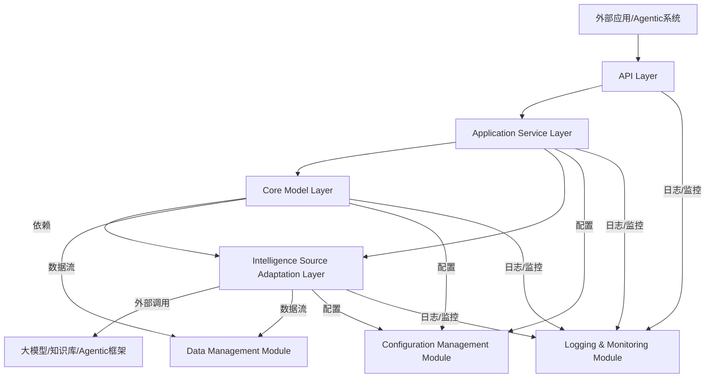

# USMSB模型SDK详细设计

## 1. 引言

本详细设计文档旨在深入阐述USMSB（社会行为的通用系统模型）SDK的各个模块和组件，基于此前提供的《USMSB模型SDK总体架构设计》[1]文件，对其进行更具体的技术实现规划。该SDK的核心目标是提供一套标准化的、可扩展的接口和工具集，使开发者能够方便地在各类应用中集成和利用USMSB模型，尤其是在大模型驱动的Agentic系统开发中，将大模型作为USMSB模型中的“智力源泉”进行深度融合。本设计将从核心模型层、智力源适配层、应用服务层、接口层以及支撑组件等方面进行详细说明，为后续的开发工作提供清晰的指导。

## 2. 设计原则回顾与深化

USMSB SDK的设计将严格遵循并深化以下核心原则：

*   **模块化与可扩展性**：SDK将划分为高度解耦的模块，每个模块职责单一，便于独立开发、测试、部署和维护。通过定义清晰的接口和抽象层，确保未来能够方便地引入新的USMSB要素、通用行动实现、核心逻辑变体或外部智力源（如不同的大模型、新的Agentic框架）。
*   **灵活性与可配置性**：提供丰富的配置选项，允许开发者根据具体应用场景（如模拟社会行为、个人健康管理、金融投资等）调整模型参数、选择不同的智力源（例如，选择使用Gemini或GPT系列大模型）、配置数据存储方式和集成策略。配置应支持运行时动态加载和更新。
*   **高性能与效率**：考虑到大模型推理可能带来的潜在性能瓶颈和高昂成本，SDK将优化数据处理流程，支持异步操作（例如，通过`asyncio`实现非阻塞I/O），并提供多级缓存机制（如内存缓存、持久化缓存）以减少重复计算和API调用，从而提高整体效率和响应速度。
*   **易用性与开发者友好**：提供简洁、直观、符合主流编程范式的API接口（例如，Pythonic风格的API）。同时，将提供详尽的文档（包括API参考、概念指南、快速入门教程）、丰富的示例代码和最佳实践，以降低开发者的学习曲线和使用门槛。
*   **可观测性与调试性**：内置完善的日志记录（支持不同日志级别和输出目标）、事件追踪和性能指标收集机制。这将便于开发者监控SDK的运行状态、诊断潜在问题、分析性能瓶颈并进行优化。可与主流监控系统（如Prometheus, Grafana）集成。
*   **安全性与隐私保护**：在处理敏感数据（如用户个人信息、财务数据）和调用外部服务时，SDK将遵循行业安全最佳实践。包括但不限于：数据加密（传输中和静态）、访问控制、API密钥的安全管理、输入验证、输出过滤，并提供必要的隐私保护机制（如数据脱敏、匿名化）。
*   **领域无关性与通用性**：USMSB模型本身是通用系统模型，SDK的设计将保持其领域无关性，通过配置和扩展机制，使其能够灵活应用于社会科学、自然科学、经济学、电子商务、个人管理等多个领域，而不是针对某个特定领域进行硬编码。

## 3. 总体架构与模块划分

USMSB SDK的总体架构将采用清晰的分层设计，确保各层职责明确，降低耦合度。主要包括以下几个核心层和支撑组件：

1.  **核心模型层 (Core Model Layer)**：SDK的基础，实现USMSB模型的核心要素（Agent, Object, Goal, Resource, Rule, Information, Value, Risk, Environment）、通用行动的抽象接口和核心逻辑（Goal-Action-Outcome Loop, Information-Decision-Control Loop等）的定义与协调。该层不直接依赖于具体的智力源实现，保持高度抽象和稳定。
2.  **智力源适配层 (Intelligence Source Adaptation Layer)**：SDK的关键创新点，负责与外部大模型（LLMs）、知识库、Agentic框架等“智力源”进行交互。它定义了统一的适配接口，并提供针对不同智力源的具体实现，将外部智力源的能力（如文本生成、理解、推理、工具使用）适配到USMSB模型中。
3.  **应用服务层 (Application Service Layer)**：基于核心模型层和智力源适配层，提供面向具体应用场景的高级服务和功能。这些服务将组合USMSB要素、通用行动和智力源的能力，实现复杂的功能，如行为预测、决策支持、系统模拟、Agentic工作流编排等。
4.  **接口层 (API Layer)**：提供统一的编程接口，供外部应用（如Python应用程序、Web服务、Agentic系统）调用SDK的功能。支持多种接口形式，如Pythonic API、RESTful API。

此外，还将包括以下支撑组件，贯穿于各层之间：

*   **数据管理模块 (Data Management Module)**：负责SDK内部数据的存储、检索、管理和持久化，包括USMSB要素实例、历史行为数据、模拟结果、配置信息等。
*   **配置管理模块 (Configuration Management Module)**：负责管理SDK的各项配置，包括智力源的API Key、模型参数、日志级别、缓存策略等。
*   **日志与监控模块 (Logging & Monitoring Module)**：提供全面的日志记录和性能监控功能，帮助开发者理解SDK的运行状态、诊断问题和优化性能。



## 4. 核心模块详细设计

### 4.1 核心模型层 (Core Model Layer)

该层是USMSB SDK的基础，负责定义和管理USMSB模型中的核心概念。它将是相对稳定的部分，不直接依赖于具体的大模型实现，通过抽象接口与智力源适配层交互。

#### 4.1.1 USMSB要素定义

USMSB模型中的九个核心要素将定义为独立的Python类或数据类（如使用`dataclasses`或Pydantic），每个要素应包含其基本属性、类型提示和必要的验证逻辑。这些类将是SDK内部数据模型的基础。

**示例：`Agent` 类定义**

```python
from dataclasses import dataclass, field
from typing import List, Dict, Any, Optional

@dataclass
class Goal:
    id: str
    name: str
    description: str
    priority: int = 0
    status: str = 


    "pending"
    associated_agent_id: Optional[str] = None

@dataclass
class Resource:
    id: str
    name: str
    type: str  # e.g., "tangible", "intangible"
    quantity: float = 0.0
    unit: Optional[str] = None
    status: str = "available"
    owner_agent_id: Optional[str] = None

@dataclass
class Rule:
    id: str
    name: str
    description: str
    type: str  # e.g., "legal", "social", "algorithmic"
    scope: List[str] = field(default_factory=list)
    priority: int = 0

@dataclass
class Information:
    id: str
    content: Any
    type: str  # e.g., "text", "image", "data", "event"
    source: Optional[str] = None
    timestamp: float = field(default_factory=lambda: datetime.now().timestamp())
    quality: float = 1.0  # 0.0 to 1.0

@dataclass
class Value:
    id: str
    name: str
    type: str  # e.g., "economic", "social", "health", "emotional"
    metric: Optional[float] = None
    description: Optional[str] = None
    associated_entity_id: Optional[str] = None

@dataclass
class Risk:
    id: str
    name: str
    description: str
    type: str  # e.g., "market", "technical", "operational"
    probability: float = 0.0  # 0.0 to 1.0
    impact: float = 0.0  # 0.0 to 1.0
    associated_entity_id: Optional[str] = None

@dataclass
class Environment:
    id: str
    name: str
    type: str  # e.g., "natural", "social", "technological", "economic"
    state: Dict[str, Any] = field(default_factory=dict)
    influencing_factors: List[str] = field(default_factory=list)

@dataclass
class Object:
    id: str
    name: str
    type: str
    properties: Dict[str, Any] = field(default_factory=dict)
    current_state: Dict[str, Any] = field(default_factory=dict)

@dataclass
class Agent:
    id: str
    name: str
    type: str  # e.g., "human", "ai_agent", "organization"
    capabilities: List[str] = field(default_factory=list)
    state: Dict[str, Any] = field(default_factory=dict)
    goals: List[Goal] = field(default_factory=list)
    resources: List[Resource] = field(default_factory=list)
    rules: List[Rule] = field(default_factory=list)
    # Operations will be methods of a service or manager class, not directly on dataclass

```

**表 4-1：USMSB核心要素及其属性**

| 要素 (Element) | 核心属性 (Core Attributes) | 描述 (Description) |
| :------------- | :------------------------- | :----------------- |
| **Agent (主体)** | ID, 名称, 类型, 能力集, 状态, 目标列表, 资源持有量, 规则集引用 | 具有感知、决策、行动能力的实体，如人类、AI Agent、组织等。 |
| **Object (客体)** | ID, 名称, 类型, 状态, 属性集合 | Agent行动作用的对象，如产品、服务、数据、物理实体等。 |
| **Goal (目标)** | ID, 名称, 描述, 优先级, 状态, 关联主体 | Agent希望达成的预期状态或结果。 |
| **Resource (资源)** | ID, 名称, 类型, 数量/价值, 状态, 持有者 | Agent可利用的一切投入，包括有形（资金、时间）和无形（知识、经验）。 |
| **Rule (规则)** | ID, 名称, 描述, 类型, 适用范围, 优先级 | 约束Agent行为和系统运作的规范、标准和限制。 |
| **Information (信息)** | ID, 内容, 类型, 来源, 时间戳, 质量/可信度 | 系统中产生、传递、处理和利用的数据、知识、信号。 |
| **Value (价值)** | ID, 名称, 类型, 量化指标/描述, 关联主体/客体 | Agent行动产生的效益、意义或效用。 |
| **Risk (风险)** | ID, 名称, 描述, 类型, 发生概率, 潜在影响, 关联主体/客体/行动 | 系统中可能出现的不确定性及其潜在的负面影响。 |
| **Environment (环境)** | ID, 名称, 类型, 状态, 影响因素 | Agent所处的外部条件和背景，如自然、社会、技术环境。 |

#### 4.1.2 USMSB通用行动接口

USMSB模型中的通用行动将定义为抽象基类（Abstract Base Classes, ABCs）或协议（Protocols），以便于不同的智力源适配器或应用服务层提供具体的实现。这些接口将作为SDK内部服务调用的标准契约。

```python
from abc import ABC, abstractmethod
from typing import Any, Dict, List, Optional

class IPerceptionService(ABC):
    """提供感知能力，如文本理解、图像识别、数据分析等。"""
    @abstractmethod
    async def perceive(self, input_data: Any, context: Dict[str, Any] = None) -> Information:
        pass

class IDecisionService(ABC):
    """提供决策能力，如行动选择、策略生成、路径规划等。"""
    @abstractmethod
    async def decide(self, agent: Agent, goal: Goal, context: Dict[str, Any] = None) -> Dict[str, Any]:
        pass

class IExecutionService(ABC):
    """提供执行能力，如代码执行、API调用、模拟操作等。"""
    @abstractmethod
    async def execute(self, action: Dict[str, Any], agent: Agent, context: Dict[str, Any] = None) -> Any:
        pass

class IInteractionService(ABC):
    """提供交互能力，如多Agent通信、人机对话等。"""
    @abstractmethod
    async def interact(self, sender: Agent, receiver: Agent, message: Any, context: Dict[str, Any] = None) -> Any:
        pass

class ITransformationService(ABC):
    """提供转化能力，如数据格式转换、资源形态转换等。"""
    @abstractmethod
    async def transform(self, input_data: Any, target_type: str, context: Dict[str, Any] = None) -> Any:
        pass

class IEvaluationService(ABC):
    """提供评估能力，如效果评估、风险评估、价值评估等。"""
    @abstractmethod
    async def evaluate(self, item: Any, criteria: str, context: Dict[str, Any] = None) -> Value:
        pass

class IFeedbackService(ABC):
    """提供反馈处理能力，如用户反馈分析、系统自适应调整等。"""
    @abstractmethod
    async def process_feedback(self, feedback_data: Any, context: Dict[str, Any] = None) -> Dict[str, Any]:
        pass

class ILearningService(ABC):
    """提供学习能力，如模型微调、知识更新、行为优化等。"""
    @abstractmethod
    async def learn(self, experience_data: Any, agent: Agent, context: Dict[str, Any] = None) -> Dict[str, Any]:
        pass

class IRiskManagementService(ABC):
    """提供风险管理能力，如风险识别、风险规避、风险缓解等。"""
    @abstractmethod
    async def manage_risk(self, risk: Risk, agent: Agent, context: Dict[str, Any] = None) -> Dict[str, Any]:
        pass

```

**表 4-2：USMSB通用行动接口及其职责**

| 通用行动 (General Action) | 接口名称 (Interface Name) | 职责描述 (Responsibility) |
| :---------------------- | :------------------------ | :------------------------ |
| **感知 (Perception)** | `IPerceptionService` | 从环境中获取并理解信息，如文本、图像、数据。 |
| **决策 (Decision-making)** | `IDecisionService` | 根据目标、规则、信息等选择行动方案或策略。 |
| **执行 (Execution)** | `IExecutionService` | 实施决策，将抽象行动转化为具体操作。 |
| **交互 (Interaction)** | `IInteractionService` | Agent之间或Agent与环境/用户之间的信息交换和协作。 |
| **转化 (Transformation)** | `ITransformationService` | 资源形态、数据格式等的改变，实现价值增值。 |
| **评估 (Evaluation)** | `IEvaluationService` | 衡量行动结果、系统状态与目标的符合程度。 |
| **反馈 (Feedback)** | `IFeedbackService` | 处理评估结果，将其作为输入调整后续行动或策略。 |
| **学习 (Learning)** | `ILearningService` | 从经验中获取知识，优化Agent的行为模式和能力。 |
| **风险管理 (Risk Management)** | `IRiskManagementService` | 识别、评估、规避和缓解潜在风险。 |

#### 4.1.3 USMSB核心逻辑实现

USMSB模型中的六个核心逻辑将通过协调上述要素和通用行动接口，形成完整的系统行为。这些逻辑将由核心模型层中的协调器（Coordinators）或引擎（Engines）来实现。

1.  **Goal-Action-Outcome Loop (目标-行动-结果循环)**：
    *   **实现方式**：设计一个`GoalManager`或`LoopEngine`，负责追踪Agent的目标状态。当目标未达成时，驱动Agent通过`IPerceptionService`感知环境，`IDecisionService`生成行动计划，`IExecutionService`执行行动。行动结果通过`IEvaluationService`进行评估，并将评估结果作为`IFeedbackService`的输入，从而调整后续行动或目标本身。该循环将是异步且持续运行的。
    *   **关键组件**：`GoalManager`, `ActionPlanner`, `ResultEvaluator`。

2.  **Resource-Transformation-Value Chain (资源-转化-价值增值链)**：
    *   **实现方式**：`ResourceManager`负责管理Agent的资源（`Resource`实例）的分配、消耗和状态更新。当资源被用于某个行动时，`ITransformationService`将被调用以模拟资源的转化过程，并由`IEvaluationService`评估其产生的`Value`。该链条将提供API来追踪资源的流转和价值的累积。
    *   **关键组件**：`ResourceManager`, `ValueCalculator`。

3.  **Information-Decision-Control Loop (信息-决策-控制回路)**：
    *   **实现方式**：`InformationProcessor`负责从`IPerceptionService`接收原始数据，并将其转化为结构化的`Information`实例。这些信息被传递给`IDecisionService`进行决策。决策结果将作为`IExecutionService`的控制指令，作用于`Object`或`Environment`。执行结果又产生新的信息，形成闭环。该回路强调信息的实时性和决策的响应性。
    *   **关键组件**：`InformationProcessor`, `DecisionEngine`, `ControlMechanism`。

4.  **System-Environment Interaction (系统-环境互动)**：
    *   **实现方式**：`EnvironmentManager`负责维护`Environment`实例的状态，并提供接口供Agent通过`IPerceptionService`感知环境变化，或通过`IExecutionService`对环境施加影响。SDK将支持模拟环境变化或接入真实环境数据。该模块还将处理环境对Agent的反馈，例如资源枯竭、规则变化等。
    *   **关键组件**：`EnvironmentManager`, `EnvironmentSimulator`。

5.  **Emergence and Self-organization (涌现与自组织)**：
    *   **实现方式**：该逻辑不直接通过某个服务实现，而是通过SDK中多个Agent的`Interaction`和`Execution`的复杂交织而自然产生。SDK将提供`ObservationModule`和`AnalysisTool`，用于收集和分析多Agent交互数据，识别和可视化系统中涌现的宏观模式和自组织行为。这可能涉及到复杂网络分析、统计模式识别等。
    *   **关键组件**：`ObservationModule`, `PatternRecognizer`。

6.  **Adaptation and Evolution (适应与演化)**：
    *   **实现方式**：`EvolutionManager`将协调`ILearningService`和`IFeedbackService`，根据Agent的长期表现和环境变化，触发Agent自身能力、规则集或目标优先级的调整。这可能涉及到强化学习、元学习或基于规则的自适应机制。该逻辑旨在实现系统的长期稳定性和优化。
    *   **关键组件**：`EvolutionManager`, `AdaptivePolicyEngine`.

### 4.2 智力源适配层 (Intelligence Source Adaptation Layer)

该层是SDK的关键创新点，负责将外部大模型、知识库、Agentic框架等作为USMSB模型中的“智力源”进行集成。它将定义统一的适配接口，允许接入不同类型和厂商的智力源，并处理与外部API的交互细节。

#### 4.2.1 智力源抽象接口

定义一套抽象接口，用于封装不同智力源的具体实现细节，向上层提供统一的调用方式。所有接口都将是异步的，以支持非阻塞操作。

```python
from abc import ABC, abstractmethod
from typing import Any, Dict, List, Optional

class IIntelligenceSource(ABC):
    """通用智力源接口，包含初始化、调用、关闭等方法。"""
    @abstractmethod
    async def initialize(self, config: Dict[str, Any]):
        pass

    @abstractmethod
    async def shutdown(self):
        pass

    @abstractmethod
    async def is_available(self) -> bool:
        pass

class ILLMAdapter(IIntelligenceSource):
    """大模型适配器接口，封装大模型的文本生成、理解、推理等能力。"""
    @abstractmethod
    async def generate_text(self, prompt: str, context: Dict[str, Any] = None, **kwargs) -> str:
        pass

    @abstractmethod
    async def understand_intent(self, text: str, schema: Dict[str, Any] = None, **kwargs) -> Dict[str, Any]:
        pass

    @abstractmethod
    async def reason(self, facts: List[str], query: str, context: Dict[str, Any] = None, **kwargs) -> str:
        pass

    @abstractmethod
    async def evaluate(self, item: Any, criteria: str, context: Dict[str, Any] = None, **kwargs) -> Dict[str, Any]:
        pass

class IKnowledgeBaseAdapter(IIntelligenceSource):
    """知识库适配器接口，封装知识检索、知识图谱查询等能力。"""
    @abstractmethod
    async def query_knowledge(self, query: str, context: Dict[str, Any] = None, **kwargs) -> List[Dict[str, Any]]:
        pass

    @abstractmethod
    async def retrieve_facts(self, entity: str, context: Dict[str, Any] = None, **kwargs) -> List[str]:
        pass

class IAgenticFrameworkAdapter(IIntelligenceSource):
    """Agentic框架适配器接口，封装Agent的规划、工具使用、多Agent协作等能力。"""
    @abstractmethod
    async def plan_action_sequence(self, goal: Goal, current_state: Dict[str, Any], available_tools: List[str], context: Dict[str, Any] = None, **kwargs) -> List[Dict[str, Any]]:
        pass

    @abstractmethod
    async def execute_tool(self, tool_name: str, params: Dict[str, Any], context: Dict[str, Any] = None, **kwargs) -> Dict[str, Any]:
        pass

    @abstractmethod
    async def coordinate_agents(self, task: Dict[str, Any], agents: List[Agent], context: Dict[str, Any] = None, **kwargs) -> Dict[str, Any]:
        pass

```

**表 4-3：智力源抽象接口及其核心方法**

| 接口类型 (Interface Type) | 接口名称 (Interface Name) | 核心方法 (Core Methods) | 职责描述 (Responsibility) |
| :------------------------ | :------------------------ | :---------------------- | :------------------------ |
| **通用智力源** | `IIntelligenceSource` | `initialize()`, `shutdown()`, `is_available()` | 所有智力源的基类，定义生命周期和可用性。 |
| **大模型适配器** | `ILLMAdapter` | `generate_text()`, `understand_intent()`, `reason()`, `evaluate()` | 封装大模型的文本生成、理解、推理、评估能力。 |
| **知识库适配器** | `IKnowledgeBaseAdapter` | `query_knowledge()`, `retrieve_facts()` | 封装知识检索、事实提取能力。 |
| **Agentic框架适配器** | `IAgenticFrameworkAdapter` | `plan_action_sequence()`, `execute_tool()`, `coordinate_agents()` | 封装Agent的规划、工具使用、多Agent协作能力。 |

#### 4.2.2 具体智力源实现

针对不同的大模型（如Gemini, GPT系列, Llama等）、知识库（如向量数据库、图数据库）、Agentic框架（如LangChain, AutoGen）提供具体的适配器实现。这些实现将负责处理与外部API的通信、认证、请求限速、错误处理、数据格式转换等底层细节。

*   **`GeminiLLMAdapter`**：实现`ILLMAdapter`接口，通过Google Cloud SDK或REST API调用Gemini模型。支持配置模型版本、温度、top-k等参数。
*   **`OpenAIGPTAdapter`**：实现`ILLMAdapter`接口，通过OpenAI Python库或REST API调用GPT系列模型。支持配置模型版本、API Key、组织ID等。
*   **`HuggingFaceLLMAdapter`**：实现`ILLMAdapter`接口，支持加载和调用Hugging Face Hub上的开源模型，可配置本地推理或API服务。
*   **`VectorDBKnowledgeBaseAdapter`**：实现`IKnowledgeBaseAdapter`接口，支持与主流向量数据库（如Pinecone, Weaviate, Milvus）集成，进行语义搜索和RAG（Retrieval-Augmented Generation）。
*   **`GraphDBKnowledgeBaseAdapter`**：实现`IKnowledgeBaseAdapter`接口，支持与图数据库（如Neo4j）集成，进行知识图谱查询和推理。
*   **`LangChainAgenticAdapter`**：实现`IAgenticFrameworkAdapter`接口，封装LangChain的Agent、Chain、Tool等概念，将USMSB的行动映射到LangChain的工作流。
*   **`AutoGenAgenticAdapter`**：实现`IAgenticFrameworkAdapter`接口，封装AutoGen的多Agent协作能力，支持配置Agent角色、对话模式等。

#### 4.2.3 智力源管理 (Intelligence Source Manager)

`IntelligenceSourceManager`是智力源适配层的核心组件，负责管理和配置可用的智力源实例，并提供统一的访问入口。它将支持动态注册、选择、负载均衡和故障切换。

*   **注册表 (Registry)**：维护所有已注册智力源的列表，包括其类型、配置和当前状态。支持通过配置文件或编程方式进行注册。
*   **选择器 (Selector)**：根据上层应用的需求（如特定LLM类型、性能要求、成本偏好）和智力源的可用性，动态选择最合适的智力源实例。可实现轮询、随机、基于负载等选择策略。
*   **连接池 (Connection Pool)**：管理与外部智力源的连接，优化连接复用，减少连接开销。
*   **API Key管理**：安全地管理和使用各类智力源的API Key，避免硬编码，支持从环境变量、密钥管理服务中加载。
*   **健康检查与故障切换**：定期检查智力源的可用性，当某个智力源出现故障时，能够自动切换到备用智力源，确保系统的鲁棒性。

### 4.3 应用服务层 (Application Service Layer)

该层基于核心模型层和智力源适配层，提供面向具体应用场景的高级服务。这些服务将组合USMSB要素、通用行动和智力源的能力，实现复杂的功能。每个服务都将是一个独立的模块，可按需启用。

1.  **`BehaviorPredictionService` (行为预测服务)**：
    *   **职责**：预测USMSB模型中Agent的未来行为、系统演化趋势以及潜在结果。
    *   **输入**：`Agent`实例、`Environment`状态、历史`Information`、`Goal`、`Rule`等。
    *   **输出**：预测的行动序列、概率分布、可能的结果场景、风险评估。
    *   **实现**：结合`IDecisionService`（由LLM驱动的推理能力）和`SystemSimulationService`。LLM可以根据当前情境和历史数据，生成Agent的可能行为路径，并评估其合理性。例如，预测消费者在特定营销活动下的购买行为。

2.  **`DecisionSupportService` (决策支持服务)**：
    *   **职责**：为用户或Agent提供多维度、智能化的决策建议。
    *   **输入**：决策情境描述、相关`Information`、`Resource`、`Rule`、多个备选方案。
    *   **输出**：最优决策建议、备选方案的优劣势分析、风险评估、潜在影响分析。
    *   **实现**：利用`ILLMAdapter`的`reason`和`evaluate`能力，结合`IEvaluationService`对备选方案进行多维度评估。可集成`IKnowledgeBaseAdapter`获取额外背景知识。

3.  **`SystemSimulationService` (系统模拟服务)**：
    *   **职责**：构建和运行基于USMSB模型的复杂系统仿真，模拟Agent行为、环境变化和系统演化。
    *   **输入**：USMSB系统配置（`Agent`集合、`Environment`、`Rule`等）、模拟参数（时间步长、迭代次数）。
    *   **输出**：模拟过程数据（Agent状态、交互记录）、系统演化趋势、涌现行为报告、关键指标统计。
    *   **实现**：作为核心模型层中“Goal-Action-Outcome Loop”和“System-Environment Interaction”的协调者。它将调度多个Agent的行动，更新环境状态，并记录所有事件。可利用`IAgenticFrameworkAdapter`来驱动模拟中的Agent行为。

4.  **`AgenticWorkflowService` (Agentic工作流服务)**：
    *   **职责**：编排和执行基于USMSB模型的复杂Agentic工作流，实现任务分解、规划、工具使用和多Agent协作。
    *   **输入**：复杂任务描述、可用的`Tool`定义、`Agent`角色定义、初始`Environment`状态。
    *   **输出**：Agent执行计划、工具调用序列、任务完成状态、中间结果。
    *   **实现**：深度依赖`IAgenticFrameworkAdapter`。LLM负责任务分解和规划，生成一系列子任务和工具调用。`IExecutionService`负责执行工具。`IInteractionService`用于Agent之间的通信和协作。该服务将是构建复杂AI Agent应用的核心。

### 4.4 接口层 (API Layer)

接口层是SDK与外部世界交互的门户，提供统一、开发者友好的编程接口。主要提供Pythonic API，并可选择性地提供RESTful API。

1.  **Python SDK (Primary API)**：
    *   **设计理念**：提供一套直观、易用的Python类和函数，遵循Python的最佳实践（如类型提示、异步支持）。
    *   **核心类**：
        *   `USMSBManager`：作为SDK的入口点，负责初始化、配置加载、智力源管理，并提供对应用服务层的访问。
        *   `AgentBuilder`：用于方便地创建和配置`Agent`实例，支持链式调用。
        *   `EnvironmentBuilder`：用于创建和配置`Environment`实例。
        *   `USMSBContext`：封装当前系统状态，方便在不同服务间传递。
    *   **示例 API 调用**：
        ```python
        from usmsb_sdk import USMSBManager, Agent, Goal, Environment

        # 初始化SDK
        sdk_manager = USMSBManager(config_path="./config.yaml")
        await sdk_manager.initialize()

        # 创建Agent和环境
        user_agent = Agent(id="user_1", name="Alice", type="human", capabilities=["learn", "decide"])
        current_env = Environment(id="city_traffic", name="Smart City Traffic", type="technological", state={"traffic_flow": "heavy"})

        # 获取行为预测服务
        prediction_service = sdk_manager.get_service("BehaviorPredictionService")

        # 预测Agent行为
        predicted_actions = await prediction_service.predict_behavior(user_agent, current_env, goal=Goal(id="g1", name="Reduce commute time"))
        print(f"Predicted actions: {predicted_actions}")

        # 关闭SDK
        await sdk_manager.shutdown()
        ```

2.  **RESTful API (Optional)**：
    *   **设计理念**：提供基于HTTP的RESTful接口，便于跨语言、跨平台集成，尤其适用于微服务架构。
    *   **技术栈**：可采用FastAPI或Flask等Python Web框架实现。
    *   **核心端点**：
        *   `/agents`: 创建、查询、更新Agent实例。
        *   `/environments`: 创建、查询、更新Environment实例。
        *   `/predict_behavior`: 调用行为预测服务。
        *   `/decide_action`: 调用决策支持服务。
        *   `/simulate_system`: 启动系统模拟。
    *   **认证与授权**：支持API Key或OAuth2等认证机制。
    *   **数据格式**：请求和响应均采用JSON格式。

### 4.5 支撑组件

这些组件将为SDK的各个层提供基础支持，确保SDK的稳定、高效运行。

#### 4.5.1 数据管理模块 (Data Management Module)

负责SDK内部数据的存储、检索、管理和持久化。将采用分层设计，包括数据模型、数据访问层和存储层。

*   **数据模型**：如4.1.1节所述，USMSB要素将定义为Python数据类。这些数据类将与ORM（Object-Relational Mapping）框架（如SQLAlchemy）或ODM（Object-Document Mapping）框架（如MongoEngine）结合，实现与底层数据库的映射。
*   **数据访问层 (Data Access Layer, DAL)**：提供统一的CRUD（Create, Read, Update, Delete）接口，封装底层数据库操作。DAL将是抽象的，允许切换不同的数据库后端。
    *   **接口**：`IEntityRepository<T>`，提供`add(entity)`, `get(id)`, `update(entity)`, `delete(id)`, `query(filters)`等方法。
*   **存储层 (Storage Layer)**：
    *   **关系型数据库**：支持PostgreSQL, MySQL等，适用于需要强事务和复杂查询的场景。
    *   **NoSQL数据库**：支持MongoDB, Redis（用于缓存）等，适用于高并发、灵活数据模型的场景。
    *   **向量数据库**：用于存储和检索`Information`中的嵌入向量，支持RAG等高级功能。
*   **缓存机制**：
    *   **内存缓存**：使用`functools.lru_cache`或自定义字典实现，用于短期、高频访问的数据。
    *   **分布式缓存**：使用Redis等，用于跨进程或跨服务的数据共享和缓存。
    *   **智力源响应缓存**：缓存LLM的推理结果，减少重复调用和成本。

#### 4.5.2 配置管理模块 (Configuration Management Module)

负责SDK的各项配置的加载、管理和更新。将支持多源配置和优先级管理。

*   **配置源**：
    *   **文件配置**：支持YAML, JSON, INI等格式的配置文件，便于版本控制和部署。
    *   **环境变量**：用于敏感信息（如API Key）和部署环境相关的配置。
    *   **命令行参数**：用于临时覆盖配置。
    *   **配置中心**：可集成Consul, Nacos等配置中心，支持动态配置更新。
*   **配置加载与解析**：提供统一的配置加载器，按优先级合并不同来源的配置。
*   **配置验证**：对加载的配置进行Schema验证，确保配置的正确性。
*   **动态配置**：支持部分配置在运行时动态修改，无需重启SDK。

#### 4.5.3 日志与监控模块 (Logging & Monitoring Module)

提供全面的日志记录和性能监控功能，帮助开发者理解SDK的运行状态、诊断问题和优化性能。

*   **日志记录**：
    *   **日志库**：使用Python内置的`logging`模块，支持多种日志级别（DEBUG, INFO, WARNING, ERROR, CRITICAL）。
    *   **日志输出**：支持输出到控制台、文件、远程日志服务（如ELK Stack, Loki）。
    *   **结构化日志**：输出JSON格式日志，便于机器解析和分析。
    *   **可追踪性**：在日志中包含请求ID、Agent ID等上下文信息，便于追踪请求链路。
*   **性能监控**：
    *   **指标收集**：收集关键性能指标，如API响应时间、CPU利用率、内存使用、并发请求数、智力源调用次数和延迟等。
    *   **指标暴露**：通过Prometheus Exporter或OpenTelemetry等标准协议暴露指标，便于与外部监控系统集成。
    *   **健康检查**：提供`/health`等端点，用于外部系统检查SDK的健康状态。
*   **事件追踪**：
    *   **事件总线**：内部事件总线（如基于`asyncio`队列或第三方库），用于发布和订阅SDK内部的关键事件（如Agent状态变化、决策完成、风险识别）。
    *   **分布式追踪**：可集成OpenTelemetry等分布式追踪系统，追踪跨服务、跨模块的请求链路。

## 5. 大模型与Agentic系统作为智力源的引入（深化）

本SDK设计中，大模型和Agentic系统被视为核心的“智力源”，它们的能力将通过智力源适配层注入到USMSB模型中，赋能USMSB要素的通用行动和核心逻辑。这一部分将更深入地探讨其集成机制和作用。

### 5.1 大模型在USMSB通用行动中的应用

大模型（LLMs）的引入极大地增强了USMSB模型中Agent的认知和行动能力，使其能够处理更复杂、更开放的任务。

1.  **感知 (Perception) 的强化**：
    *   **语义理解与信息提取**：LLM能够对非结构化数据（如用户输入的自然语言、新闻报道、社交媒体帖子、传感器数据描述）进行深度语义理解，从中提取USMSB要素（如主体、客体、目标、规则、风险）及其属性。例如，从一段描述中识别出“用户（Agent）”的“购买意图（Goal）”和“商品（Object）”的“价格（Information）”。
    *   **情境感知与知识增强**：LLM可以综合多源信息（包括通过`IKnowledgeBaseAdapter`获取的外部知识），构建更全面的情境模型，帮助USMSB中的“主体”更好地理解当前“环境”状态。例如，结合实时交通数据、天气预报和历史交通模式，生成对当前城市交通状况的综合分析报告。
    *   **多模态感知**：随着多模态LLM的发展，SDK将能够利用其能力处理图像、音频、视频等非文本信息，将其转化为可供USMSB模型使用的`Information`要素。

2.  **决策 (Decision-making) 的智能化**：
    *   **策略生成与规划**：LLM能够根据USMSB中的“目标”、“规则”、“资源”和“环境”信息，生成多种可能的行动策略或详细的行动计划。例如，为AI Agent规划一系列步骤以完成特定任务（如“预订机票”），或为企业提供多种市场营销策略建议。
    *   **推理与判断**：LLM可以进行复杂的逻辑推理、因果判断和常识推理，帮助“主体”评估不同行动方案的潜在“结果”和“风险”，从而做出更优的决策。例如，预测某个政策调整对特定行业可能产生的影响，或评估不同投资组合的风险收益比。
    *   **个性化决策**：结合个体“主体”的偏好、历史行为和“价值”取向，LLM可以生成高度个性化的决策建议。例如，为消费者推荐个性化的商品，或为投资者提供定制化的投资组合建议，考虑其风险偏好和财务目标。

3.  **执行 (Execution) 的自动化与工具使用**：
    *   **代码生成与执行**：LLM可以直接生成可执行的代码（如Python脚本、SQL查询、API调用代码），用于操作“客体”、处理“信息”或与外部系统交互。`IExecutionService`将负责安全地执行这些代码。Agentic系统可以利用这些代码实现自动化执行。
    *   **工具调用 (Tool Use)**：通过Agentic框架，LLM能够智能地选择和调用外部工具（如数据库查询工具、API调用工具、计算工具、网络搜索工具），将抽象的决策转化为具体的“执行”动作。例如，根据决策结果调用电商平台的API完成订单，或调用天气API获取实时天气信息。
    *   **多模态执行**：除了文本，LLM还可以生成图像、音频、视频脚本等多种形式的输出，用于更丰富的“执行”和“交互”方式。例如，生成一个产品的宣传图片，或一段营销视频的文案。

4.  **交互 (Interaction) 的自然化与协作化**：
    *   **自然语言交互**：LLM使得USMSB中的“主体”能够以自然语言与人类用户进行高效、流畅的“交互”，理解用户意图并生成富有语境的回复。这对于构建用户友好的Agentic应用至关重要。
    *   **多Agent协作**：Agentic系统结合LLM，可以实现多个AI Agent之间的智能协作。LLM可以作为协调者，帮助Agent之间进行信息共享、任务分配、冲突解决，从而实现USMSB模型中“涌现与自组织”的复杂行为。例如，在模拟供应链中，不同Agent（生产商、零售商、消费者）通过LLM进行沟通和协调。

5.  **学习 (Learning) 与适应 (Adaptation) 的持续优化**：
    *   **经验学习与模式识别**：LLM可以通过处理大量的历史数据和“反馈”信息，从中学习模式、规律和因果关系，从而优化其在USMSB模型中的“感知”、“决策”和“执行”能力。这包括对Agent自身行为的优化和对环境变化的适应。
    *   **强化学习与微调**：结合强化学习机制，LLM可以从与环境的“交互”中获得奖励或惩罚，并据此调整其行为策略，实现USMSB模型中的“适应与演化”逻辑。通过持续的微调（Fine-tuning）或Prompt工程优化，LLM能够更好地适应特定领域和任务，提升其作为智力源的性能。
    *   **知识更新与自我修正**：LLM可以从新的“信息”中提取知识，并将其整合到自身的知识体系中，从而实现USMSB模型中“信息”的动态更新和“学习”的持续进行。当发现自身推理错误或产生“幻觉”时，LLM可以通过自我修正机制进行调整。

### 5.2 大模型在USMSB核心逻辑中的作用

LLM作为核心智能引擎，能够显著增强USMSB模型的六个核心逻辑的效率和效果。

1.  **目标-行动-结果循环的智能驱动**：
    *   **智能目标设定**：LLM可以根据“环境”和“主体”状态，辅助设定更合理、可量化的“目标”，并将其分解为可执行的子目标。
    *   **动态行动规划**：在循环过程中，LLM能够根据实时“信息”和“评估”结果，动态调整“行动”计划，应对突发情况。
    *   **结果深度分析**：LLM能够对“结果”进行更深入的分析，识别成功或失败的原因，并生成有价值的“反馈”信息，指导Agent进行学习和调整。

2.  **信息-决策-控制回路的增强**：
    *   **信息处理中枢**：LLM作为信息处理的核心，能够高效地从海量、异构的“信息”中提取关键洞察，并将其转化为可用于“决策”的结构化数据，过滤噪音。
    *   **智能决策引擎**：LLM直接驱动“决策”过程，将复杂的推理逻辑封装在内部，对外提供简洁、高效的决策输出。
    *   **精细控制指令**：LLM能够生成更精细、更具适应性的“控制”指令，指导“执行”模块对“客体”或“环境”进行操作，实现精准控制。

3.  **涌现与自组织行为的模拟与分析**：
    *   **微观行为生成**：LLM可以模拟USMSB中“主体”的微观行为，这些行为在Agentic系统中通过“交互”和“执行”得以实现，从而为宏观涌现行为提供基础。
    *   **宏观模式识别与解释**：通过对大量Agent微观行为的模拟，LLM可以帮助识别和分析系统中“涌现”出的宏观模式和自组织行为，例如市场趋势、社会舆论的形成。同时，LLM可以尝试解释这些模式背后的原因。
    *   **可解释性分析**：LLM可以辅助解释为什么会产生特定的涌现行为，从而增强对复杂社会现象的理解，并为干预提供依据。

4.  **系统-环境互动**：
    *   LLM可以模拟环境的动态变化，并评估环境变化对Agent行为和系统状态的影响。同时，LLM也可以模拟Agent行为对环境的反作用，形成双向互动。

5.  **资源-转化-价值增值链**：
    *   LLM可以帮助Agent更智能地分配和利用资源，优化转化过程，从而最大化价值增值。例如，LLM可以分析不同资源配置方案的潜在价值。

6.  **适应与演化**：
    *   LLM通过持续学习和微调，不断提升其在USMSB模型中的“智力”表现，从而增强整个系统的“学习”和“适应”能力，使其能够更好地应对未知和复杂性。

### 5.3 数据流与交互模式（深化）

USMSB SDK中大模型与Agentic系统的集成将涉及以下关键数据流和交互模式，强调异步和事件驱动：

1.  **外部输入/环境感知**：
    *   **数据流**：原始数据（文本、传感器数据、API响应） -> `IPerceptionService` (可能调用`ILLMAdapter`进行语义解析/信息提取) -> 结构化`Information`实例。
    *   **交互模式**：SDK接收外部事件或定期从环境管理器拉取数据。

2.  **USMSB要素实例化与状态更新**：
    *   **数据流**：结构化`Information` -> `USMSBManager`或特定`Builder` -> `Agent`, `Object`, `Environment`等要素实例的创建或更新。
    *   **交互模式**：SDK内部维护USMSB要素的生命周期和状态。

3.  **目标驱动与行动规划**：
    *   **数据流**：`Agent`的`Goal`和当前`Environment`状态 -> `GoalManager` -> `ActionPlanner` (调用`IAgenticFrameworkAdapter`的`plan_action_sequence`，由LLM驱动) -> 结构化行动计划（包含子任务、工具调用序列）。
    *   **交互模式**：异步调用，LLM根据复杂情境生成多步规划。

4.  **信息获取与决策**：
    *   **数据流**：行动计划中的子任务/工具调用需求 -> `IDecisionService` (调用`ILLMAdapter`的`reason`或`understand_intent`) -> 具体操作指令或工具参数。
    *   **交互模式**：LLM作为决策核心，根据实时信息和规则进行判断，生成下一步行动的详细指令。

5.  **工具执行与结果反馈**：
    *   **数据流**：操作指令/工具参数 -> `IExecutionService` (调用`IAgenticFrameworkAdapter`的`execute_tool`或直接执行代码) -> 外部工具/API/环境交互 -> 原始执行结果。
    *   **交互模式**：异步执行，执行结果作为新的原始数据返回给感知模块，形成闭环。

6.  **评估与学习**：
    *   **数据流**：执行结果、Agent状态、Goal状态 -> `IEvaluationService` (可能调用`ILLMAdapter`的`evaluate`) -> `Value`和`Risk`实例，以及反馈数据。
    *   **交互模式**：评估结果传递给`ILearningService`和`IFeedbackService`，用于Agent的经验学习、模型微调和系统适应性调整。

7.  **循环迭代与优化**：
    *   **数据流**：反馈数据 -> `EvolutionManager` -> 调整`Agent`的`capabilities`、`rules`、`goals`或`state`。
    *   **交互模式**：整个过程形成一个持续的闭环，Agent在USMSB核心逻辑的驱动下，不断感知、决策、执行、评估、反馈和学习，直至`Goal`达成或条件终止。数据管理模块负责持久化所有关键数据，以便进行离线分析和模型训练。

```mermaid
graph TD
    subgraph USMSB_SDK["USMSB SDK"]
        subgraph Core_Model_Layer["Core Model Layer"]
            CML_A["Agent/Object/Goal/Resource/Rule/Information/Value/Risk/Environment"]
            CML_B["Goal-Action-Outcome Loop Engine"]
            CML_C["Information-Decision-Control Loop Engine"]
            CML_D["System-Environment Interaction Manager"]
            CML_E["Evolution Manager"]
        end

        subgraph Intelligence_Source_Adaptation_Layer["Intelligence Source Adaptation Layer"]
            ISAL_A["ILLMAdapter"]
            ISAL_B["IKnowledgeBaseAdapter"]
            ISAL_C["IAgenticFrameworkAdapter"]
            ISAL_D["Intelligence Source Manager"]
        end

        subgraph Application_Service_Layer["Application Service Layer"]
            ASL_A["BehaviorPredictionService"]
            ASL_B["DecisionSupportService"]
            ASL_C["SystemSimulationService"]
            ASL_D["AgenticWorkflowService"]
        end

        subgraph API_Layer["API Layer"]
            API_A["Python SDK"]
            API_B["RESTful API Optional"]
        end

        subgraph Supporting_Components["Supporting Components"]
            SC_A["Data Management Module"]
            SC_B["Configuration Management Module"]
            SC_C["Logging & Monitoring Module"]
        end
    end

    External["外部系统/用户/环境"] --> API_A
    External --> API_B

    API_A --> ASL_A
    API_A --> ASL_B
    API_A --> ASL_C
    API_A --> ASL_D

    API_B --> ASL_A
    API_B --> ASL_B
    API_B --> ASL_C
    API_B --> ASL_D

    ASL_A --> CML_A
    ASL_A --> ISAL_A
    ASL_B --> CML_A
    ASL_B --> ISAL_A
    ASL_B --> ISAL_B
    ASL_C --> CML_A
    ASL_C --> CML_B
    ASL_C --> CML_C
    ASL_C --> CML_D
    ASL_C --> ISAL_C
    ASL_D --> CML_A
    ASL_D --> CML_B
    ASL_D --> ISAL_A
    ASL_D --> ISAL_C

    CML_A -.-> SC_A
    CML_B -.-> SC_A
    CML_C -.-> SC_A
    CML_D -.-> SC_A
    CML_E -.-> SC_A

    ISAL_A -.-> SC_B
    ISAL_B -.-> SC_B
    ISAL_C -.-> SC_B
    ISAL_D -.-> SC_B

    API_A -.-> SC_C
    API_B -.-> SC_C
    ASL_A -.-> SC_C
    ASL_B -.-> SC_C
    ASL_C -.-> SC_C
    ASL_D -.-> SC_C
    CML_A -.-> SC_C
    CML_B -.-> SC_C
    CML_C -.-> SC_C
    CML_D -.-> SC_C
    CML_E -.-> SC_C
    ISAL_A -.-> SC_C
    ISAL_B -.-> SC_C
    ISAL_C -.-> SC_C
    ISAL_D -.-> SC_C

    ISAL_A --> External_Services["大模型服务/知识库/Agentic框架"]
    ISAL_B --> External_Services
    ISAL_C --> External_Services

    SC_A --> DB["数据库/文件系统"]
    SC_C --> MonitoringSystem["监控系统/日志分析"]

```



### 5.4 挑战与应对策略（深化）

在USMSB SDK的开发和部署过程中，将面临一系列挑战，需要提前规划应对策略。

1.  **性能与延迟**：
    *   **挑战**：大模型推理通常需要较高的计算资源和时间，可能导致SDK响应延迟，影响实时应用。
    *   **应对策略**：
        *   **异步化设计**：SDK内部所有与外部智力源的交互都采用异步（`async/await`）模式，避免阻塞主线程。
        *   **缓存机制**：对LLM的推理结果、知识库查询结果等进行多级缓存（内存缓存、分布式缓存），减少重复计算和API调用。
        *   **模型优化**：支持选择更轻量级、响应速度更快的模型（如蒸馏模型、量化模型），或在边缘设备部署小型模型。
        *   **Prompt工程优化**：精简Prompt，减少不必要的token消耗，提高推理效率。
        *   **批处理**：对于可以并行处理的请求，进行批处理，减少API调用次数。

2.  **成本控制**：
    *   **挑战**：大模型API调用可能产生较高费用，尤其是在大规模模拟或高频交互场景下。
    *   **应对策略**：
        *   **精细化调用策略**：根据任务重要性、实时性要求，选择合适的LLM模型（成本-性能权衡）。
        *   **结果缓存**：如上所述，有效利用缓存机制，减少重复付费调用。
        *   **成本监控与预警**：集成成本监控工具，实时跟踪API使用量和费用，设置预警机制。
        *   **本地部署**：对于高频、敏感或成本敏感的场景，考虑本地部署开源LLM或小型模型。

3.  **可解释性与可控性**：
    *   **挑战**：大模型的“黑箱”特性可能导致其决策过程难以解释和控制，影响SDK在关键决策场景的应用。
    *   **应对策略**：
        *   **Prompt工程与约束**：通过精心设计的Prompt和System Message，明确LLM的角色、任务和约束，引导其行为。
        *   **决策路径追踪**：记录LLM的输入、输出、中间推理步骤和工具调用，提供可追溯的决策链条。
        *   **人类干预 (Human-in-the-Loop)**：在关键决策点引入人工审核和干预机制，允许人类修正或覆盖LLM的决策。
        *   **可解释AI (XAI) 技术**：探索集成LIME, SHAP等XAI工具，对LLM的决策进行局部解释。

4.  **幻觉与偏见**：
    *   **挑战**：大模型可能产生不准确、不连贯或带有偏见的信息（“幻觉”）。
    *   **应对策略**：
        *   **RAG (Retrieval-Augmented Generation)**：结合`IKnowledgeBaseAdapter`，在生成回复前从可靠知识库中检索相关事实，减少幻觉。
        *   **多模型交叉验证**：在重要场景下，使用多个LLM进行交叉验证，提高信息准确性。
        *   **事实核查**：集成外部事实核查工具或人工审核流程。
        *   **数据清洗与偏见检测**：在训练或微调LLM时，关注训练数据的质量和偏见，并进行相应的处理。

5.  **安全性与隐私**：
    *   **挑战**：处理敏感数据时，大模型可能存在数据泄露风险；API Key管理不当可能导致安全漏洞。
    *   **应对策略**：
        *   **数据脱敏与匿名化**：在将敏感数据发送给外部LLM之前进行脱敏或匿名化处理。
        *   **本地部署私有模型**：对于高度敏感的数据，考虑在受控环境中本地部署LLM。
        *   **严格的访问控制**：对SDK的API和内部组件实施严格的认证和授权机制。
        *   **加密通信**：所有网络通信（包括与LLM API的通信）都采用TLS/SSL加密。
        *   **API Key管理**：使用密钥管理服务（如AWS KMS, Azure Key Vault）或环境变量安全存储和管理API Key。

6.  **版本管理与兼容性**：
    *   **挑战**：大模型和Agentic框架的快速迭代可能导致SDK与外部智力源之间的兼容性问题。
    *   **应对策略**：
        *   **抽象适配层**：智力源适配层作为隔离层，将SDK核心逻辑与具体智力源实现解耦，降低外部变化的影响。
        *   **版本兼容性测试**：定期对SDK与最新版本LLM/Agentic框架进行兼容性测试。
        *   **提供清晰的升级路径和迁移指南**：当智力源API发生重大变化时，提供详细的升级文档和工具。

## 6. 开放式生态平台与应用准备（深化）

USMSB SDK的设计充分考虑了未来构建开放式生态平台的需求，以及在社会科学、自然科学、经济学、电子商务等领域的应用。这将通过插件化架构、开放API和社区支持来实现。

### 6.1 开放式生态平台支持

1.  **插件化架构**：
    *   **智力源插件**：允许第三方开发者贡献新的`ILLMAdapter`, `IKnowledgeBaseAdapter`, `IAgenticFrameworkAdapter`实现，以支持更多的大模型、知识库和Agentic框架。
    *   **应用服务插件**：允许开发者构建和注册新的`Application Service`模块，扩展SDK的功能，满足特定领域的需求。
    *   **要素扩展**：提供机制允许用户自定义USMSB要素的属性或创建新的子类型。
    *   **实现方式**：采用Python的入口点（Entry Points）机制或简单的插件注册机制，通过配置文件或代码动态加载插件。

2.  **API开放性**：
    *   **稳定且版本化的API**：提供清晰、稳定且版本化的Python API和RESTful API，确保向后兼容性，便于第三方应用和平台集成USMSB SDK的功能。
    *   **详细的API文档**：提供Swagger/OpenAPI规范的RESTful API文档，以及Sphinx/MkDocs生成的Python API文档。

3.  **数据标准与互操作性**：
    *   **USMSB数据模型规范**：推动USMSB要素和行动的数据模型规范化，促进不同应用之间的数据互操作性。
    *   **数据导入/导出工具**：提供工具支持将USMSB模型中的数据导入导出为常见格式（如JSON, CSV），便于与其他系统集成。

4.  **社区支持与贡献**：
    *   **开发者门户**：提供一个集文档、示例、论坛、代码仓库于一体的开发者门户。
    *   **贡献指南**：提供清晰的贡献指南，鼓励开发者提交代码、报告Bug、提出功能建议。
    *   **社区活动**：组织线上/线下研讨会、黑客松，促进社区交流和协作。

### 6.2 应用领域适配准备

SDK的通用性和可扩展性使其能够灵活适配多个应用领域，通过配置和领域特定的数据/规则集实现快速部署。

1.  **社会科学**：
    *   **应用场景**：模拟社会行为、分析社会现象（如舆论传播、群体决策）、预测社会趋势、评估政策影响。
    *   **适配方式**：通过配置不同的`Agent`类型（如个体、群体、组织）、`Rule`集（如社会规范、法律法规、文化习俗），将社会学理论映射为USMSB模型。利用LLM模拟人类行为和认知过程。

2.  **自然科学**：
    *   **应用场景**：模拟生物系统（如细胞交互、生态系统动态）、化学反应、物理现象。
    *   **适配方式**：将自然实体（如分子、细胞、物种）映射为USMSB的`Agent`和`Object`，将自然定律和物理规则映射为`Rule`。利用LLM的科学推理能力进行模拟和预测，例如，预测蛋白质折叠、药物分子设计。

3.  **经济学与金融**：
    *   **应用场景**：模拟市场参与者行为（消费者、企业、政府）、供需关系、价格波动、政策影响，进行经济预测和政策评估、金融风险管理。
    *   **适配方式**：将市场参与者定义为`Agent`，商品、货币、金融产品定义为`Object`和`Resource`，经济学原理和市场规则定义为`Rule`。LLM可以模拟市场情绪、消费者心理，增强经济模型的真实性。

4.  **电子商务与市场营销**：
    *   **应用场景**：模拟消费者购买行为、商家运营策略、平台推荐机制、广告效果预测，优化电商平台设计和营销策略。
    *   **适配方式**：将消费者、商家、平台定义为`Agent`，商品、订单定义为`Object`，营销策略、推荐算法定义为`Rule`。LLM可以模拟用户画像、购买决策路径，提供个性化推荐和营销优化建议。

5.  **个人管理与智能助理**：
    *   **应用场景**：个人学习与职业提升、健康管理、理财投资、日程规划等。
    *   **适配方式**：将用户自身定义为核心`Agent`，其目标、资源、信息、风险等都映射到USMSB要素。LLM作为智能助理，增强用户的感知、决策、学习能力，提供个性化建议和自动化执行。

通过提供灵活的配置和扩展机制，SDK将能够适应不同领域的特定需求，并利用大模型的通用智能赋能各领域的应用，实现USMSB模型在更广泛范围内的落地。

## 7. 总结与展望

本详细设计文档对USMSB模型SDK的各个层面进行了深入阐述，从核心模型层的数据结构和接口定义，到智力源适配层的LLM和Agentic系统集成机制，再到应用服务层的高级功能和支撑组件，都进行了详细规划。该SDK旨在构建一个强大、灵活、可扩展的工具集，以支持基于USMSB模型的各类应用开发，特别是大模型驱动的Agentic系统。

通过清晰的模块划分、抽象的接口设计以及对大模型和Agentic系统的深度集成，该SDK将为开发者提供前所未有的能力，用于理解、模拟和构建复杂的社会行为系统。它将赋能Agent具备更强的感知、决策、执行、交互、学习和风险管理能力，从而在各种复杂场景中实现更智能、更自主的行为。

未来的工作将包括：

*   **技术选型与原型开发**：根据详细设计，选择具体的编程语言（Python）、框架和库，并启动原型开发，验证架构设计的可行性和性能指标。
*   **持续迭代与优化**：在开发过程中，根据实际测试和用户反馈，持续迭代和优化SDK的性能、稳定性和易用性。
*   **文档与示例**：编写详尽的开发者文档、API参考手册和丰富的示例代码，降低开发者的学习成本。
*   **社区建设**：积极推动社区建设，鼓励开发者参与贡献，共同完善USMSB生态系统。

我们相信，USMSB SDK的推出将极大地推动USMSB模型在理论研究和实际应用中的发展，为构建更智能、更高效、更健康的数字社会贡献力量。

---

**作者信息**：Felix Gu
**完成日期**：2025年2月
**版本**：1.0

**参考文献**：

[1] USMSB模型SDK总体架构设计. (2025). [内部文档].


